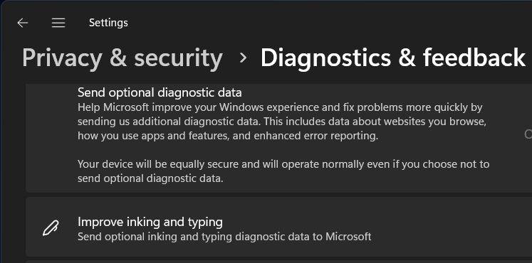

# Immutable Windows with atomic updates (kinda... not really)


Второй вторник каждого месяца Microsoft и некоторые другие компании выпускают регулярные обновления для своих продуктов. Это так называемый Patch Tuesday. Среди прочего, в этот день Microsoft публикует commulative update для Windows - накопительный пакет обновлений, который включает все предыдущие исправления.

Однако, не все обновления одинаково полезны. Microsoft в попытках монетизировать пользовательскую базу агрессивно внедряет рекламу и сбор персональных данных в свои продукты. С каждым обновлением Microsoft добавляет всё больше подобных инструментов и усложняет их отключение. Это касается не только условно бесплатных продуктов и сервисов вроде Bing, но даже платных корпоративных решений, таких как Windows Enterprise. Делается это под предлогом персонализации пользовательского опыта и улучшения продуктов. Например, для улучшения своих продуктов Microsoft по умолчанию собирает всё, что вы вводите с клавиатуры.



Я не желаю безвозмездно делиться персональными данными с компанией стоимостью в несколько триллионов долларов или видеть рекламу в продукте, за который заплатил деньги. Поэтому я использую OPNsense firewall для блокировки всех подключений к серверам Microsoft. В обмен на душевное спокойствие мне приходится каждый месяц вручную загружать и устанавливать обновления. Недавно я решил частично автоматизировать эту задачу. В процессе написания скрипта я осознал, что пытаюсь реализовать некое подобие атомарных обновления из мира Linux.


Исходный код скрипта доступен в [GitHub](https://github.com/ruslanbay/immutable-windows). Я использовал этот проект чтобы подтянуть знания в PowerShell. Я уверен что написал велосипед и существует более простое решение, но мне его найти не удалось. Поиск по ключевым фразам "Immutable Windows" или "Windows atomic updates" выдаёт только страницы форумов, где объясняется почему это невозможно или почему так делать не стоит. Если вам известны инструменты, которые реализуют подобную логику, пожалуйста, поделитесь 🙏

## Реализация

Если вы знакомы с Linux, то, вероятно, слышали о дистрибутивах NixOS, CoreOS, Ubuntu Core, Fedora Atomic или Silverblue. Все они основаны на концепции неизменяемого дизайна (immutable design), который предполагает что системные файлы доступны только на чтение. Обновление таких дистрибутивов часто выполняется как единая операция (atomic update), что исключает риск получения системы в несогласованном или нестабильном состоянии. При возникновении проблем пользователь может загрузить систему из предыдущего состояния. Этот подход к архитектуре операционной системы обеспечивает повторяемость и повышенную безопасность, позволяет избежать непредвиденных изменений, делает систему в целом более надежной и предсказуемой. К Windows термин immutable не применим, так как системные файлы не защищены от изменений и, насколько мне известно, штатными средствами реализовать immutable design в Windows невозможно. При этом добавить в Windows некоторую вариацию атомарных обновлений - вполне посильная задача.

Одна из недооценённых фич Windows - возможность загрузки системы из файла VHDX, который представляет собой образ жёсткого диска. Загрузка из VHDX позволяет иметь на одном компьютере несколько инсталляций Windows без необходимости создавать на жёстком диске отдельный раздел для каждой из них. VHDX файл можно использовать для создания дочерних образов. То есть вы можете создать VHDX-образ с базовой инсталляцией Windows, затем использовать этот образ для получения отдельной системы, например, для работы, для игр, для доступа к банковским сервисам и прочее. В дочерние образы записываются только изменения (дельта), поэтому несколько дочерних инсталляций, созданных на основе одного и того же базового образа, занимают на жестком диске меньше пространства чем несколько систем, установленных независимо.

Для реализации атомарных обновлений я добавлю в Планировщик Windows задачу, которая сразу после запуска системы проверяет наличие в заданном каталоге файлов-обновлений "*.msu". Если файлы найдены, то скрипт использует базовый VHDX для создания дочернего образа, затем применяет к этому новому образу обновления и делает его загрузочным по умолчанию. Если во время старта системы создавать из базового VHDX дочерний образ и использовать его во время следующей загрузки, то получим некоторое подобие immutable операционной системы.


### Подготовка базового образа

В классическом случае пользователь скачивает iso-образ с сайта Microsoft, устанавливает систему, затем подключается к Сети и загружает обновления. Проблема в том, что Microsoft обновляет установочные образы один-два раза в год и без актуальных патчей подключаться к Интернет небезопасно - злоумышленники могут использовать известные уязвимости чтобы скомпрометировать систему.

Пользователь может скачать Cumulative Update Package с [сайта Microsoft](https://catalog.update.microsoft.com) и обновить систему offline. Для автоматзиации этого процесса я воспользуюсь встроенным в Windows инструментом Deployment Image Servicing and Management (DISM.exe). DISM позволяет модифицировать установочный образ, установить драйвера, удалить несипользуемые приложения и "фичи", изменить настройки системы. Но обо всём по порядку.

Для начала скачаем установочный iso с [официального сайта Microsoft](https://www.microsoft.com/software-download/windows11). Если вы откроете эту страницу с компьютера под управлением Windows, то ссылка на iso-файл может не отображаться. В этом случае воспользуйтесь другим устройством или измените User-Agent в браузере. Я буду работать с файлом `Win11_24H2_EnglishInternational_x64.iso` (5.7 GB):

```PowerShell
Get-ChildItem D:\images\Win11_24H2_EnglishInternational_x64.iso | Format-Table -Property Name, Length
Name                                          Length
----                                          ------
Win11_24H2_EnglishInternational_x64.iso 5832091648
```

```PowerShell
Get-FileHash -algorithm sha256 D:\images\Win11_24H2_EnglishInternational_x64.iso | Format-Table -Property Algorithm, Hash
Algorithm Hash
--------- ----
SHA256    D5A4C97C3E835C43B1B9A31933327C001766CE314608BA912F2FFFC876044309
```

Далее смонтируем iso-образ и скопируем файл `sources\install.wim` в каталог `D:\images\`.

```PowerShell
$imagePath = "D:\images\Win11_24H2_EnglishInternational_x64.iso"

Mount-DiskImage -ImagePath $imagePath

$volume = Get-Volume | Where-Object { $_.FileSystemLabel -eq "CCCOMA_X64FRE_EN-GB_DV9" }

Copy-Item -Path "$($volume.DriveLetter):\sources\install.wim" -Destination "D:\images\"

Dismount-DiskImage -ImagePath $imagePath
```

Теперь откроем PowerShell с правами администратор и с помощью утилиты DISM посмотрим список редакций Windows, которые доступны для установки:

```PowerShell
Dism /Get-ImageInfo /ImageFile:"D:\images\install.wim"

Deployment Image Servicing and Management tool
Version: 10.0.22621.2792

Details for image : D:\images\install.wim

Index : 1
Name : Windows 11 Home
Description : Windows 11 Home
Size : 18,709,107,315 bytes

Index : 2
Name : Windows 11 Home N
Description : Windows 11 Home N
Size : 18,162,298,137 bytes

Index : 3
Name : Windows 11 Home Single Language
Description : Windows 11 Home Single Language
Size : 18,688,958,400 bytes

Index : 4
Name : Windows 11 Education
Description : Windows 11 Education
Size : 19,213,845,892 bytes

Index : 5
Name : Windows 11 Education N
Description : Windows 11 Education N
Size : 18,673,246,054 bytes

Index : 6
Name : Windows 11 Pro
Description : Windows 11 Pro
Size : 19,216,462,493 bytes

Index : 7
Name : Windows 11 Pro N
Description : Windows 11 Pro N
Size : 18,675,690,173 bytes

Index : 8
Name : Windows 11 Pro Education
Description : Windows 11 Pro Education
Size : 19,213,896,530 bytes

Index : 9
Name : Windows 11 Pro Education N
Description : Windows 11 Pro Education N
Size : 18,673,271,823 bytes

Index : 10
Name : Windows 11 Pro for Workstations
Description : Windows 11 Pro for Workstations
Size : 19,213,947,168 bytes

Index : 11
Name : Windows 11 Pro N for Workstations
Description : Windows 11 Pro N for Workstations
Size : 18,673,297,592 bytes
```

Я выберу Windows 11 Pro N. "N" означает "Not with Media Player", эта редакция не включает кодеки и некоторые другие фичи, которыми я в любом случае не пользуюсь. Чтобы посмотреть дополнительную информацию об этой редакции выполним ту же самую команду с параметром `/index:7`:

```PowerShell
Dism /Get-ImageInfo /ImageFile:"D:\images\install.wim" /index:7

Deployment Image Servicing and Management tool
Version: 10.0.22621.2792

Details for image : D:\images\install.wim

Index : 7
Name : Windows 11 Pro N
Description : Windows 11 Pro N
Size : 18,675,690,173 bytes
WIM Bootable : No
Architecture : x64
Hal : <undefined>
Version : 10.0.26100
ServicePack Build : 1742
ServicePack Level : 0
Edition : ProfessionalN
Installation : Client
ProductType : WinNT
ProductSuite : Terminal Server
System Root : WINDOWS
Directories : 24762
Files : 107921
Created : 06/09/2024 - 04:26:57
Modified : 06/09/2024 - 05:06:35
Languages :
        en-GB (Default)
The operation completed successfully.
```

Сделаем файл install.wim доступным для записи:
```PowerShell
Set-ItemProperty -Path "D:\images\install.wim" -Name IsReadOnly -Value $false
```

Далее создадим каталог `D:\images\mnt` и смонтируем в него образ `install.wim`:

```PowerShell
New-Item -ItemType Directory -Path "D:\images\mnt"

Dism /Mount-Image /ImageFile:"D:\images\install.wim" /index:7 /MountDir:"D:\images\mnt"
```

#### Получаем список активированных фич
```PowerShell
Dism /Image:"D:\images\mnt" /Get-Features /English /Format:Table | Select-String -pattern ".+Enabled.*"
Windows-Defender-Default-Definitions        | Enabled
MicrosoftWindowsPowerShellV2Root            | Enabled
MicrosoftWindowsPowerShellV2                | Enabled
WorkFolders-Client                          | Enabled
WCF-Services45                              | Enabled
WCF-TCP-PortSharing45                       | Enabled
SmbDirect                                   | Enabled
Printing-PrintToPDFServices-Features        | Enabled
SearchEngine-Client-Package                 | Enabled
Printing-Foundation-Features                | Enabled
Printing-Foundation-InternetPrinting-Client | Enabled
MSRDC-Infrastructure                        | Enabled
NetFx4-AdvSrvs                              | Enabled
```

#### Удаляем неиспользуемые фичи:
```PowerShell
Dism /Image:"D:\images\mnt" /Disable-Feature /FeatureName:Windows-Defender-Default-Definitions
Dism /Image:"D:\images\mnt" /Disable-Feature /FeatureName:Printing-PrintToPDFServices-Features
Dism /Image:"D:\images\mnt" /Disable-Feature /FeatureName:MSRDC-Infrastructure
Dism /Image:"D:\images\mnt" /Disable-Feature /FeatureName:MicrosoftWindowsPowerShellV2Root
Dism /Image:"D:\images\mnt" /Disable-Feature /FeatureName:MicrosoftWindowsPowerShellV2
Dism /Image:"D:\images\mnt" /Disable-Feature /FeatureName:NetFx4-AdvSrvs
Dism /Image:"D:\images\mnt" /Disable-Feature /FeatureName:WCF-Services45
Dism /Image:"D:\images\mnt" /Disable-Feature /FeatureName:WCF-TCP-PortSharing45
Dism /Image:"D:\images\mnt" /Disable-Feature /FeatureName:MediaPlayback
Dism /Image:"D:\images\mnt" /Disable-Feature /FeatureName:SearchEngine-Client-Package
Dism /Image:"D:\images\mnt" /Disable-Feature /FeatureName:Microsoft-RemoteDesktopConnection
Dism /Image:"D:\images\mnt" /Disable-Feature /FeatureName:WorkFolders-Client
Dism /Image:"D:\images\mnt" /Disable-Feature /FeatureName:Printing-Foundation-Features
Dism /Image:"D:\images\mnt" /Disable-Feature /FeatureName:Printing-Foundation-InternetPrinting-Client
Dism /Image:"D:\images\mnt" /Disable-Feature /FeatureName:SmbDirect
```

#### Получаем список предустановленных системных компонентов
```PowerShell
Dism /Image:"D:\images\mnt" /Get-Capabilities /Format:Table | Select-String "Installed"

App.StepsRecorder~~~~0.0.1.0                                   | Installed
Browser.InternetExplorer~~~~0.0.11.0                           | Installed
DirectX.Configuration.Database~~~~0.0.1.0                      | Installed
Hello.Face.20134~~~~0.0.1.0                                    | Installed
Language.Basic~~~en-GB~0.0.1.0                                 | Installed
Language.Handwriting~~~en-GB~0.0.1.0                           | Installed
Language.OCR~~~en-GB~0.0.1.0                                   | Installed
Language.Speech~~~en-GB~0.0.1.0                                | Installed
Language.TextToSpeech~~~en-GB~0.0.1.0                          | Installed
MathRecognizer~~~~0.0.1.0                                      | Installed
Microsoft.Wallpapers.Extended~~~~0.0.1.0                       | Installed
Microsoft.Windows.Ethernet.Client.Intel.E1i68x64~~~~0.0.1.0    | Installed
Microsoft.Windows.Ethernet.Client.Intel.E2f68~~~~0.0.1.0       | Installed
Microsoft.Windows.Ethernet.Client.Realtek.Rtcx21x64~~~~0.0.1.0 | Installed
Microsoft.Windows.Ethernet.Client.Vmware.Vmxnet3~~~~0.0.1.0    | Installed
Microsoft.Windows.Notepad.System~~~~0.0.1.0                    | Installed
Microsoft.Windows.PowerShell.ISE~~~~0.0.1.0                    | Installed
Microsoft.Windows.Sense.Client~~~~                             | Installed
Microsoft.Windows.Wifi.Client.Broadcom.Bcmpciedhd63~~~~0.0.1.0 | Installed
Microsoft.Windows.Wifi.Client.Broadcom.Bcmwl63al~~~~0.0.1.0    | Installed
Microsoft.Windows.Wifi.Client.Broadcom.Bcmwl63a~~~~0.0.1.0     | Installed
Microsoft.Windows.Wifi.Client.Intel.Netwbw02~~~~0.0.1.0        | Installed
Microsoft.Windows.Wifi.Client.Intel.Netwew00~~~~0.0.1.0        | Installed
Microsoft.Windows.Wifi.Client.Intel.Netwew01~~~~0.0.1.0        | Installed
Microsoft.Windows.Wifi.Client.Intel.Netwlv64~~~~0.0.1.0        | Installed
Microsoft.Windows.Wifi.Client.Intel.Netwns64~~~~0.0.1.0        | Installed
Microsoft.Windows.Wifi.Client.Intel.Netwsw00~~~~0.0.1.0        | Installed
Microsoft.Windows.Wifi.Client.Intel.Netwtw02~~~~0.0.1.0        | Installed
Microsoft.Windows.Wifi.Client.Intel.Netwtw04~~~~0.0.1.0        | Installed
Microsoft.Windows.Wifi.Client.Intel.Netwtw06~~~~0.0.1.0        | Installed
Microsoft.Windows.Wifi.Client.Intel.Netwtw08~~~~0.0.1.0        | Installed
Microsoft.Windows.Wifi.Client.Intel.Netwtw10~~~~0.0.1.0        | Installed
Microsoft.Windows.Wifi.Client.Marvel.Mrvlpcie8897~~~~0.0.1.0   | Installed
Microsoft.Windows.Wifi.Client.Qualcomm.Athw8x~~~~0.0.1.0       | Installed
Microsoft.Windows.Wifi.Client.Qualcomm.Athwnx~~~~0.0.1.0       | Installed
Microsoft.Windows.Wifi.Client.Qualcomm.Qcamain10x64~~~~0.0.1.0 | Installed
Microsoft.Windows.Wifi.Client.Ralink.Netr28x~~~~0.0.1.0        | Installed
Microsoft.Windows.Wifi.Client.Realtek.Rtl8192se~~~~0.0.1.0     | Installed
Microsoft.Windows.Wifi.Client.Realtek.Rtwlane01~~~~0.0.1.0     | Installed
Microsoft.Windows.Wifi.Client.Realtek.Rtwlane13~~~~0.0.1.0     | Installed
Microsoft.Windows.Wifi.Client.Realtek.Rtwlane~~~~0.0.1.0       | Installed
OneCoreUAP.OneSync~~~~0.0.1.0                                  | Installed
OpenSSH.Client~~~~0.0.1.0                                      | Installed
Print.Management.Console~~~~0.0.1.0                            | Installed
VBSCRIPT~~~~                                                   | Installed
Windows.Kernel.LA57~~~~0.0.1.0                                 | Installed
WMIC~~~~                                                       | Installed
```

#### Удаляем неиспользуемые компоненты

```PowerShell
Dism /Image:"D:\images\mnt" /Remove-Capability /CapabilityName:App.StepsRecorder~~~~0.0.1.0
Dism /Image:"D:\images\mnt" /Remove-Capability /CapabilityName:Browser.InternetExplorer~~~~0.0.11.0
Dism /Image:"D:\images\mnt" /Remove-Capability /CapabilityName:DirectX.Configuration.Database~~~~0.0.1.0
Dism /Image:"D:\images\mnt" /Remove-Capability /CapabilityName:Hello.Face.20134~~~~0.0.1.0
Dism /Image:"D:\images\mnt" /Remove-Capability /CapabilityName:Language.Handwriting~~~en-GB~0.0.1.0
Dism /Image:"D:\images\mnt" /Remove-Capability /CapabilityName:Language.OCR~~~en-GB~0.0.1.0
Dism /Image:"D:\images\mnt" /Remove-Capability /CapabilityName:Language.Speech~~~en-GB~0.0.1.0
Dism /Image:"D:\images\mnt" /Remove-Capability /CapabilityName:Language.TextToSpeech~~~en-GB~0.0.1.0
Dism /Image:"D:\images\mnt" /Remove-Capability /CapabilityName:MathRecognizer~~~~0.0.1.0
Dism /Image:"D:\images\mnt" /Remove-Capability /CapabilityName:Media.WindowsMediaPlayer~~~~0.0.12.0
Dism /Image:"D:\images\mnt" /Remove-Capability /CapabilityName:Microsoft.Wallpapers.Extended~~~~0.0.1.0
Dism /Image:"D:\images\mnt" /Remove-Capability /CapabilityName:Microsoft.Windows.Ethernet.Client.Intel.E1i68x64~~~~0.0.1.0
Dism /Image:"D:\images\mnt" /Remove-Capability /CapabilityName:Microsoft.Windows.Ethernet.Client.Intel.E2f68~~~~0.0.1.0
Dism /Image:"D:\images\mnt" /Remove-Capability /CapabilityName:Microsoft.Windows.Ethernet.Client.Realtek.Rtcx21x64~~~~0.0.1.0
Dism /Image:"D:\images\mnt" /Remove-Capability /CapabilityName:Microsoft.Windows.Ethernet.Client.Vmware.Vmxnet3~~~~0.0.1.0
Dism /Image:"D:\images\mnt" /Remove-Capability /CapabilityName:Microsoft.Windows.Notepad.System~~~~0.0.1.0
Dism /Image:"D:\images\mnt" /Remove-Capability /CapabilityName:Microsoft.Windows.PowerShell.ISE~~~~0.0.1.0
Dism /Image:"D:\images\mnt" /Remove-Capability /CapabilityName:Microsoft.Windows.Wifi.Client.Broadcom.Bcmpciedhd63~~~~0.0.1.0
Dism /Image:"D:\images\mnt" /Remove-Capability /CapabilityName:Microsoft.Windows.Wifi.Client.Broadcom.Bcmwl63al~~~~0.0.1.0
Dism /Image:"D:\images\mnt" /Remove-Capability /CapabilityName:Microsoft.Windows.Wifi.Client.Broadcom.Bcmwl63a~~~~0.0.1.0
Dism /Image:"D:\images\mnt" /Remove-Capability /CapabilityName:Microsoft.Windows.Wifi.Client.Intel.Netwbw02~~~~0.0.1.0
Dism /Image:"D:\images\mnt" /Remove-Capability /CapabilityName:Microsoft.Windows.Wifi.Client.Intel.Netwew00~~~~0.0.1.0
Dism /Image:"D:\images\mnt" /Remove-Capability /CapabilityName:Microsoft.Windows.Wifi.Client.Intel.Netwew01~~~~0.0.1.0
Dism /Image:"D:\images\mnt" /Remove-Capability /CapabilityName:Microsoft.Windows.Wifi.Client.Intel.Netwlv64~~~~0.0.1.0
Dism /Image:"D:\images\mnt" /Remove-Capability /CapabilityName:Microsoft.Windows.Wifi.Client.Intel.Netwns64~~~~0.0.1.0
Dism /Image:"D:\images\mnt" /Remove-Capability /CapabilityName:Microsoft.Windows.Wifi.Client.Intel.Netwsw00~~~~0.0.1.0
Dism /Image:"D:\images\mnt" /Remove-Capability /CapabilityName:Microsoft.Windows.Wifi.Client.Intel.Netwtw02~~~~0.0.1.0
Dism /Image:"D:\images\mnt" /Remove-Capability /CapabilityName:Microsoft.Windows.Wifi.Client.Intel.Netwtw04~~~~0.0.1.0
Dism /Image:"D:\images\mnt" /Remove-Capability /CapabilityName:Microsoft.Windows.Wifi.Client.Intel.Netwtw06~~~~0.0.1.0
Dism /Image:"D:\images\mnt" /Remove-Capability /CapabilityName:Microsoft.Windows.Wifi.Client.Intel.Netwtw08~~~~0.0.1.0
Dism /Image:"D:\images\mnt" /Remove-Capability /CapabilityName:Microsoft.Windows.Wifi.Client.Intel.Netwtw10~~~~0.0.1.0
Dism /Image:"D:\images\mnt" /Remove-Capability /CapabilityName:Microsoft.Windows.Wifi.Client.Marvel.Mrvlpcie8897~~~~0.0.1.0
Dism /Image:"D:\images\mnt" /Remove-Capability /CapabilityName:Microsoft.Windows.Wifi.Client.Qualcomm.Athw8x~~~~0.0.1.0
Dism /Image:"D:\images\mnt" /Remove-Capability /CapabilityName:Microsoft.Windows.Wifi.Client.Qualcomm.Athwnx~~~~0.0.1.0
Dism /Image:"D:\images\mnt" /Remove-Capability /CapabilityName:Microsoft.Windows.Wifi.Client.Qualcomm.Qcamain10x64~~~~0.0.1.0
Dism /Image:"D:\images\mnt" /Remove-Capability /CapabilityName:Microsoft.Windows.Wifi.Client.Ralink.Netr28x~~~~0.0.1.0
Dism /Image:"D:\images\mnt" /Remove-Capability /CapabilityName:Microsoft.Windows.Wifi.Client.Realtek.Rtl8187se~~~~0.0.1.0
Dism /Image:"D:\images\mnt" /Remove-Capability /CapabilityName:Microsoft.Windows.Wifi.Client.Realtek.Rtl8192se~~~~0.0.1.0
Dism /Image:"D:\images\mnt" /Remove-Capability /CapabilityName:Microsoft.Windows.Wifi.Client.Realtek.Rtl819xp~~~~0.0.1.0
Dism /Image:"D:\images\mnt" /Remove-Capability /CapabilityName:Microsoft.Windows.Wifi.Client.Realtek.Rtl85n64~~~~0.0.1.0
Dism /Image:"D:\images\mnt" /Remove-Capability /CapabilityName:Microsoft.Windows.Wifi.Client.Realtek.Rtwlane01~~~~0.0.1.0
Dism /Image:"D:\images\mnt" /Remove-Capability /CapabilityName:Microsoft.Windows.Wifi.Client.Realtek.Rtwlane13~~~~0.0.1.0
Dism /Image:"D:\images\mnt" /Remove-Capability /CapabilityName:Microsoft.Windows.Wifi.Client.Realtek.Rtwlane~~~~0.0.1.0
Dism /Image:"D:\images\mnt" /Remove-Capability /CapabilityName:Microsoft.Windows.WordPad~~~~0.0.1.0
Dism /Image:"D:\images\mnt" /Remove-Capability /CapabilityName:OneCoreUAP.OneSync~~~~0.0.1.0
Dism /Image:"D:\images\mnt" /Remove-Capability /CapabilityName:OpenSSH.Client~~~~0.0.1.0
Dism /Image:"D:\images\mnt" /Remove-Capability /CapabilityName:Print.Management.Console~~~~0.0.1.0
Dism /Image:"D:\images\mnt" /Remove-Capability /CapabilityName:VBSCRIPT~~~~
```

#### Получаем список предустановленных пакетов
```PowerShell
Dism /Image:"D:\images\mnt" /Get-Packages | Select-String -pattern "Package Identity : .+"
Package Identity : Microsoft-Windows-Client-LanguagePack-Package~31bf3856ad364e35~amd64~en-GB~10.0.26100.1742
Package Identity : Microsoft-Windows-FodMetadata-Package~31bf3856ad364e35~amd64~~10.0.26100.1
Package Identity : Microsoft-Windows-FodMetadataServicing-Desktop-CompDB-Package~31bf3856ad364e35~amd64~~10.0.26100.1
Package Identity : Microsoft-Windows-FodMetadataServicing-Desktop-Metadata-Package~31bf3856ad364e35~amd64~~10.0.26100.1742
Package Identity : Microsoft-Windows-Foundation-Package~31bf3856ad364e35~amd64~~10.0.26100.1
Package Identity : Microsoft-Windows-Kernel-LA57-FoD-Package~31bf3856ad364e35~amd64~~10.0.26100.1742
Package Identity : Microsoft-Windows-LanguageFeatures-Basic-en-gb-Package~31bf3856ad364e35~amd64~~10.0.26100.1742
Package Identity : Microsoft-Windows-Licenses-ProfessionalN-Package~31bf3856ad364e35~amd64~en-GB~10.0.26100.1742
Package Identity : Microsoft-Windows-Licenses-ProfessionalN-Package~31bf3856ad364e35~amd64~~10.0.26100.1742
Package Identity : Microsoft-Windows-SenseClient-FoD-Package~31bf3856ad364e35~amd64~en-GB~10.0.26100.1
Package Identity : Microsoft-Windows-SenseClient-FoD-Package~31bf3856ad364e35~amd64~~10.0.26100.1
Package Identity : Microsoft-Windows-WMIC-FoD-Package~31bf3856ad364e35~amd64~en-GB~10.0.26100.1742
Package Identity : Microsoft-Windows-WMIC-FoD-Package~31bf3856ad364e35~amd64~~10.0.26100.1742
Package Identity : Microsoft-Windows-WMIC-FoD-Package~31bf3856ad364e35~wow64~en-GB~10.0.26100.1
Package Identity : Microsoft-Windows-WMIC-FoD-Package~31bf3856ad364e35~wow64~~10.0.26100.1742
Package Identity : OpenSSH-Client-Package~31bf3856ad364e35~amd64~~10.0.26100.1742
Package Identity : Package_for_DotNetRollup_481~31bf3856ad364e35~amd64~~10.0.9266.1
Package Identity : Package_for_RollupFix~31bf3856ad364e35~amd64~~26100.1742.1.10
Package Identity : Package_for_ServicingStack_1738~31bf3856ad364e35~amd64~~26100.1738.1.3
```

<!--
#### Удаляем неиспользуемые пакеты:
```PowerShell
Dism /Image:"D:\images\mnt" /Remove-Package /PackageName:Microsoft-Windows-LanguageFeatures-TextToSpeech-en-gb-Package~31bf3856ad364e35~amd64~~10.0.22621.2861
```
-->

#### Получаем список пакетов, которые устанавливаются автоматически для каждого нового пользователя
```PowerShell
Dism /Image:"D:\images\mnt" /Get-ProvisionedAppxPackages | Select-String -pattern "PackageName : .+"
PackageName : Clipchamp.Clipchamp_3.0.10220.0_neutral_~_yxz26nhyzhsrt
PackageName : Microsoft.ApplicationCompatibilityEnhancements_1.2401.10.0_neutral_~_8wekyb3d8bbwe
PackageName : Microsoft.BingNews_4.1.24002.0_neutral_~_8wekyb3d8bbwe
PackageName : Microsoft.BingSearch_2022.0.79.0_neutral_~_8wekyb3d8bbwe
PackageName : Microsoft.BingWeather_4.53.52892.0_neutral_~_8wekyb3d8bbwe
PackageName : Microsoft.DesktopAppInstaller_2024.112.2235.0_neutral_~_8wekyb3d8bbwe
PackageName : Microsoft.GetHelp_10.2302.10601.0_neutral_~_8wekyb3d8bbwe
PackageName : Microsoft.MicrosoftOfficeHub_18.2308.1034.0_neutral_~_8wekyb3d8bbwe
PackageName : Microsoft.MicrosoftSolitaireCollection_4.19.3190.0_neutral_~_8wekyb3d8bbwe
PackageName : Microsoft.MicrosoftStickyNotes_4.6.2.0_neutral_~_8wekyb3d8bbwe
PackageName : Microsoft.OutlookForWindows_1.0.0.0_neutral__8wekyb3d8bbwe
PackageName : Microsoft.Paint_11.2302.20.0_neutral_~_8wekyb3d8bbwe
PackageName : Microsoft.PowerAutomateDesktop_11.2401.28.0_neutral_~_8wekyb3d8bbwe
PackageName : Microsoft.ScreenSketch_2022.2307.52.0_neutral_~_8wekyb3d8bbwe
PackageName : Microsoft.SecHealthUI_1000.26100.1.0_x64__8wekyb3d8bbwe
PackageName : Microsoft.StorePurchaseApp_22312.1400.6.0_neutral_~_8wekyb3d8bbwe
PackageName : Microsoft.Todos_2.104.62421.0_neutral_~_8wekyb3d8bbwe
PackageName : Microsoft.Windows.Photos_24.24010.29003.0_neutral_~_8wekyb3d8bbwe
PackageName : Microsoft.WindowsAlarms_2022.2312.2.0_neutral_~_8wekyb3d8bbwe
PackageName : Microsoft.WindowsCalculator_2021.2311.0.0_neutral_~_8wekyb3d8bbwe
PackageName : Microsoft.WindowsCamera_2022.2312.3.0_neutral_~_8wekyb3d8bbwe
PackageName : Microsoft.WindowsFeedbackHub_2024.125.1522.0_neutral_~_8wekyb3d8bbwe
PackageName : Microsoft.WindowsNotepad_11.2312.18.0_neutral_~_8wekyb3d8bbwe
PackageName : Microsoft.WindowsStore_22401.1400.6.0_neutral_~_8wekyb3d8bbwe
PackageName : Microsoft.WindowsTerminal_3001.18.10301.0_neutral_~_8wekyb3d8bbwe
PackageName : Microsoft.XboxIdentityProvider_12.110.15002.0_neutral_~_8wekyb3d8bbwe
PackageName : Microsoft.XboxSpeechToTextOverlay_1.97.17002.0_neutral_~_8wekyb3d8bbwe
PackageName : Microsoft.YourPhone_1.24012.105.0_neutral_~_8wekyb3d8bbwe
PackageName : MicrosoftCorporationII.QuickAssist_2024.309.159.0_neutral_~_8wekyb3d8bbwe
PackageName : MicrosoftWindows.Client.WebExperience_424.1301.270.9_neutral_~_cw5n1h2txyewy
PackageName : MicrosoftWindows.CrossDevice_1.23101.22.0_neutral_~_cw5n1h2txyewy
PackageName : MSTeams_1.0.0.0_x64__8wekyb3d8bbwe
```

#### Удаляем неиспользуемые пакеты
```PowerShell
Dism /Image:"D:\images\mnt" /Remove-ProvisionedAppxPackage /PackageName:Clipchamp.Clipchamp_3.0.10220.0_neutral_~_yxz26nhyzhsrt
Dism /Image:"D:\images\mnt" /Remove-ProvisionedAppxPackage /PackageName:Microsoft.ApplicationCompatibilityEnhancements_1.2401.10.0_neutral_~_8wekyb3d8bbwe
Dism /Image:"D:\images\mnt" /Remove-ProvisionedAppxPackage /PackageName:Microsoft.BingNews_4.1.24002.0_neutral_~_8wekyb3d8bbwe
Dism /Image:"D:\images\mnt" /Remove-ProvisionedAppxPackage /PackageName:Microsoft.BingSearch_2022.0.79.0_neutral_~_8wekyb3d8bbwe
Dism /Image:"D:\images\mnt" /Remove-ProvisionedAppxPackage /PackageName:Microsoft.BingWeather_4.53.52892.0_neutral_~_8wekyb3d8bbwe
Dism /Image:"D:\images\mnt" /Remove-ProvisionedAppxPackage /PackageName:Microsoft.DesktopAppInstaller_2024.112.2235.0_neutral_~_8wekyb3d8bbwe
Dism /Image:"D:\images\mnt" /Remove-ProvisionedAppxPackage /PackageName:Microsoft.GetHelp_10.2302.10601.0_neutral_~_8wekyb3d8bbwe
Dism /Image:"D:\images\mnt" /Remove-ProvisionedAppxPackage /PackageName:Microsoft.MicrosoftOfficeHub_18.2308.1034.0_neutral_~_8wekyb3d8bbwe
Dism /Image:"D:\images\mnt" /Remove-ProvisionedAppxPackage /PackageName:Microsoft.MicrosoftSolitaireCollection_4.19.3190.0_neutral_~_8wekyb3d8bbwe
Dism /Image:"D:\images\mnt" /Remove-ProvisionedAppxPackage /PackageName:Microsoft.MicrosoftStickyNotes_4.6.2.0_neutral_~_8wekyb3d8bbwe
Dism /Image:"D:\images\mnt" /Remove-ProvisionedAppxPackage /PackageName:Microsoft.OutlookForWindows_1.0.0.0_neutral__8wekyb3d8bbwe
Dism /Image:"D:\images\mnt" /Remove-ProvisionedAppxPackage /PackageName:Microsoft.Paint_11.2302.20.0_neutral_~_8wekyb3d8bbwe
Dism /Image:"D:\images\mnt" /Remove-ProvisionedAppxPackage /PackageName:Microsoft.PowerAutomateDesktop_11.2401.28.0_neutral_~_8wekyb3d8bbwe
Dism /Image:"D:\images\mnt" /Remove-ProvisionedAppxPackage /PackageName:Microsoft.ScreenSketch_2022.2307.52.0_neutral_~_8wekyb3d8bbwe
Dism /Image:"D:\images\mnt" /Remove-ProvisionedAppxPackage /PackageName:Microsoft.SecHealthUI_1000.26100.1.0_x64__8wekyb3d8bbwe
Dism /Image:"D:\images\mnt" /Remove-ProvisionedAppxPackage /PackageName:Microsoft.StorePurchaseApp_22312.1400.6.0_neutral_~_8wekyb3d8bbwe
Dism /Image:"D:\images\mnt" /Remove-ProvisionedAppxPackage /PackageName:Microsoft.Todos_2.104.62421.0_neutral_~_8wekyb3d8bbwe
Dism /Image:"D:\images\mnt" /Remove-ProvisionedAppxPackage /PackageName:Microsoft.Windows.Photos_24.24010.29003.0_neutral_~_8wekyb3d8bbwe
Dism /Image:"D:\images\mnt" /Remove-ProvisionedAppxPackage /PackageName:Microsoft.WindowsAlarms_2022.2312.2.0_neutral_~_8wekyb3d8bbwe
Dism /Image:"D:\images\mnt" /Remove-ProvisionedAppxPackage /PackageName:Microsoft.WindowsCalculator_2021.2311.0.0_neutral_~_8wekyb3d8bbwe
Dism /Image:"D:\images\mnt" /Remove-ProvisionedAppxPackage /PackageName:Microsoft.WindowsCamera_2022.2312.3.0_neutral_~_8wekyb3d8bbwe
Dism /Image:"D:\images\mnt" /Remove-ProvisionedAppxPackage /PackageName:Microsoft.WindowsFeedbackHub_2024.125.1522.0_neutral_~_8wekyb3d8bbwe
Dism /Image:"D:\images\mnt" /Remove-ProvisionedAppxPackage /PackageName:Microsoft.WindowsNotepad_11.2312.18.0_neutral_~_8wekyb3d8bbwe
Dism /Image:"D:\images\mnt" /Remove-ProvisionedAppxPackage /PackageName:Microsoft.WindowsStore_22401.1400.6.0_neutral_~_8wekyb3d8bbwe
Dism /Image:"D:\images\mnt" /Remove-ProvisionedAppxPackage /PackageName:Microsoft.WindowsTerminal_3001.18.10301.0_neutral_~_8wekyb3d8bbwe
Dism /Image:"D:\images\mnt" /Remove-ProvisionedAppxPackage /PackageName:Microsoft.XboxIdentityProvider_12.110.15002.0_neutral_~_8wekyb3d8bbwe
Dism /Image:"D:\images\mnt" /Remove-ProvisionedAppxPackage /PackageName:Microsoft.XboxSpeechToTextOverlay_1.97.17002.0_neutral_~_8wekyb3d8bbwe
Dism /Image:"D:\images\mnt" /Remove-ProvisionedAppxPackage /PackageName:Microsoft.YourPhone_1.24012.105.0_neutral_~_8wekyb3d8bbwe
Dism /Image:"D:\images\mnt" /Remove-ProvisionedAppxPackage /PackageName:MicrosoftCorporationII.QuickAssist_2024.309.159.0_neutral_~_8wekyb3d8bbwe
Dism /Image:"D:\images\mnt" /Remove-ProvisionedAppxPackage /PackageName:MicrosoftWindows.Client.WebExperience_424.1301.270.9_neutral_~_cw5n1h2txyewy
Dism /Image:"D:\images\mnt" /Remove-ProvisionedAppxPackage /PackageName:MicrosoftWindows.CrossDevice_1.23101.22.0_neutral_~_cw5n1h2txyewy
Dism /Image:"D:\images\mnt" /Remove-ProvisionedAppxPackage /PackageName:MSTeams_1.0.0.0_x64__8wekyb3d8bbwe
```

#### Добавляем фичи
Я использую Hyper-V. В качестве примера добавлю его в систему:

```PowerShell
Dism /Image:"D:\images\mnt" /Enable-Feature /all /FeatureName:Microsoft-Hyper-V
```

#### Выполняем оптимизацию образа
```PowerShell
Dism /Image:"D:\images\mnt" /Optimize-ProvisionedAppxPackages
```

#### Правка реестра
> [!NOTE]
> TODO: Оформить в виде таблицы с описанием изменений, которые вносит каждая команда

##### Правка HKLM\SOFTWARE

```PowerShell
reg load HKLM\OFFLINE D:\images\mnt\Windows\System32\config\SOFTWARE
reg add  HKLM\OFFLINE\Microsoft\Windows\CurrentVersion\OOBE                 /v BypassNRO                     /t REG_DWORD /d 1 /f
reg add  HKLM\OFFLINE\Policies\Microsoft\Windows\OOBE                       /v DisablePrivacyExperience      /t REG_DWORD /d 1 /f
reg add  "HKLM\OFFLINE\Policies\Microsoft\Windows\Windows Chat"             /v ChatIcon                      /t REG_DWORD /d 3 /f
reg add  "HKLM\OFFLINE\Policies\Microsoft\Windows\Windows Search"           /v AllowCloudSearch              /t REG_DWORD /d 0 /f
reg add  "HKLM\OFFLINE\Policies\Microsoft\Windows\Windows Search"           /v AllowCortana                  /t REG_DWORD /d 0 /f
reg add  "HKLM\OFFLINE\Policies\Microsoft\Windows\Windows Search"           /v ConnectedSearchUseWeb         /t REG_DWORD /d 0 /f
reg add  "HKLM\OFFLINE\Policies\Microsoft\Windows\Windows Search"           /v DisableSearch                 /t REG_DWORD /d 0 /f
reg add  HKLM\OFFLINE\Policies\Microsoft\Windows\CloudContent     /v DisableWindowsConsumerFeatures     /t REG_DWORD /d 1 /f
reg add  HKLM\OFFLINE\Policies\Microsoft\Windows\CloudContent     /v DisableSoftLanding                 /t REG_DWORD /d 1 /f
reg add  HKLM\OFFLINE\Policies\Microsoft\Windows\CloudContent     /v DisableCloudOptimizedContent       /t REG_DWORD /d 1 /f
reg add  HKLM\OFFLINE\Policies\Microsoft\Windows\CloudContent     /v DisableConsumerAccountStateContent /t REG_DWORD /d 1 /f
reg add  HKLM\OFFLINE\Policies\Microsoft\Windows\AppCompat        /v AITEnable                          /t REG_DWORD /d 0 /f
reg add  HKLM\OFFLINE\Policies\Microsoft\Windows\AppCompat        /v VDMDisallowed                      /t REG_DWORD /d 1 /f
reg add  HKLM\OFFLINE\Policies\Microsoft\Windows\AppCompat        /v DisableEngine                      /t REG_DWORD /d 1 /f
reg add  HKLM\OFFLINE\Policies\Microsoft\Windows\AppCompat        /v DisablePCA                         /t REG_DWORD /d 1 /f
reg add  HKLM\OFFLINE\Policies\Microsoft\Windows\AppCompat        /v DisableUAR                         /t REG_DWORD /d 1 /f
reg add  HKLM\OFFLINE\Policies\Microsoft\Windows\DataCollection   /v AllowTelemetry                     /t REG_DWORD /d 0 /f
reg add  HKLM\OFFLINE\Policies\Microsoft\Windows\DataCollection   /v "Allow Telemetry"                  /t REG_DWORD /d 0 /f
reg add  HKLM\OFFLINE\Policies\Microsoft\Windows\DataCollection   /v AllowDeviceNameInTelemetry         /t REG_DWORD /d 0 /f
reg add  HKLM\OFFLINE\Policies\Microsoft\Windows\DataCollection   /v DisableOneSettingsDownloads        /t REG_DWORD /d 1 /f
reg add  HKLM\OFFLINE\Policies\Microsoft\Windows\DataCollection   /v DoNotShowFeedbackNotifications     /t REG_DWORD /d 1 /f
reg add  HKLM\OFFLINE\Policies\Microsoft\Windows\DataCollection   /v EnableOneSettingsAuditing          /t REG_DWORD /d 0 /f
reg add  HKLM\OFFLINE\Policies\Microsoft\Windows\DataCollection   /v LimitDiagnosticLogCollection       /t REG_DWORD /d 1 /f
reg add  HKLM\OFFLINE\Policies\Microsoft\Windows\DataCollection   /v LimitDumpCollection                /t REG_DWORD /d 1 /f
reg add  HKLM\OFFLINE\Policies\Microsoft\Dsh                      /v AllowNewsAndInterests              /t REG_DWORD /d 0 /f
reg add  HKLM\OFFLINE\Policies\Microsoft\InputPersonalization     /v RestrictImplicitTextCollection     /t REG_DWORD /d 1 /f
reg add  HKLM\OFFLINE\Policies\Microsoft\InputPersonalization     /v RestrictImplicitInkCollection      /t REG_DWORD /d 1 /f
reg add  HKLM\OFFLINE\Microsoft\PolicyManager\default\NewsAndInterests\AllowNewsAndInterests /v value   /t REG_DWORD /d 0 /f
reg add  HKLM\OFFLINE\Microsoft\Windows\CurrentVersion\Policies\DataCollection /v AllowTelemetry         /t REG_DWORD /d 0 /f
reg add  HKLM\OFFLINE\Microsoft\Windows\CurrentVersion\Policies\DataCollection /v "AllowTelemetry"       /t REG_DWORD /d 0 /f
reg add  HKLM\OFFLINE\Microsoft\Windows\CurrentVersion\Policies\DataCollection /v MaxTelemetryAllowed    /t REG_DWORD /d 1 /f
reg add  HKLM\OFFLINE\Microsoft\Windows\CurrentVersion\Policies\DataCollection /v MicrosoftEdgeDataOptIn /t REG_DWORD /d 0 /f
reg add  HKLM\OFFLINE\Microsoft\Windows\CurrentVersion\Privacy                 /v TailoredExperiencesWithDiagnosticDataEnabled /t REG_DWORD /d 0 /f
reg add  HKLM\OFFLINE\Microsoft\Windows\CurrentVersion\Policies\Explorer  /v NoRecentDocsHistory            /t REG_DWORD /d 0 /f
reg add  HKLM\OFFLINE\Microsoft\Windows\CurrentVersion\Policies\Explorer  /v NoDesktop                      /t REG_DWORD /d 1 /f
reg add  HKLM\OFFLINE\Microsoft\Windows\CurrentVersion\Policies\Explorer  /v AllowOnlineTips                /t REG_DWORD /d 0 /f
reg add  HKLM\OFFLINE\Microsoft\Windows\CurrentVersion\Policies\System    /v DisableStartupSound            /t REG_DWORD /d 1 /f
reg add  HKLM\OFFLINE\Microsoft\Windows\CurrentVersion\Explorer\Advanced  /v Start_TrackDocs                /t REG_DWORD /d 0 /f
reg add  HKLM\OFFLINE\Microsoft\Windows\CurrentVersion\Explorer\AutoplayHandlers /v DisableAutoplay         /t REG_DWORD /d 1 /f
reg add  HKLM\OFFLINE\Microsoft\Windows\CurrentVersion\Explorer\AutoplayHandlers /v DisableAutoplay  /t REG_DWORD /d 1 /f
reg add  HKLM\OFFLINE\Microsoft\Windows\CurrentVersion\Explorer\AutoplayHandlers\EventHandlersDefaultSelection\CameraAlternate\ShowPicturesOnArrival /v "(Default)" /t REG_SZ /d MSTakeNoAction /f
reg add  HKLM\OFFLINE\Microsoft\Windows\CurrentVersion\Explorer\AutoplayHandlers\EventHandlersDefaultSelection\StorageOnArrival                      /v "(Default)" /t REG_SZ /d MSTakeNoAction /f
reg add  HKLM\OFFLINE\Microsoft\Windows\CurrentVersion\Explorer\AutoplayHandlers\UserChosenExecuteHandlers\CameraAlternate\ShowPicturesOnArrival     /v "(Default)" /t REG_SZ /d MSTakeNoAction /f
reg add  HKLM\OFFLINE\Microsoft\Windows\CurrentVersion\Explorer\AutoplayHandlers\UserChosenExecuteHandlers\StorageOnArrival                          /v "(Default)" /t REG_SZ /d MSTakeNoAction /f
reg add  HKLM\OFFLINE\Microsoft\input\Settings                            /v IsVoiceTypingKeyEnabled        /t REG_DWORD /d 0 /f
reg add  HKLM\OFFLINE\Microsoft\input\Settings                            /v RestrictImplicitInkCollection  /t REG_DWORD /d 1 /f
reg add  HKLM\OFFLINE\Microsoft\input\Settings                            /v RestrictImplicitTextCollection /t REG_DWORD /d 1 /f
reg add  HKLM\OFFLINE\Microsoft\input\Settings                            /v DictationEnabled               /t REG_DWORD /d 0 /f
reg add  HKLM\OFFLINE\Microsoft\input\Settings                            /v DisablePersonalization         /t REG_DWORD /d 1 /f
reg add  HKLM\OFFLINE\Microsoft\input\Settings                            /v HarvestContacts                /t REG_DWORD /d 0 /f
reg add  HKLM\OFFLINE\Microsoft\input\Settings                            /v IsVoiceTypingKeyEnabled        /t REG_DWORD /d 0 /f
reg add  HKLM\OFFLINE\Microsoft\input\Settings                            /v InsightsEnabled                /t REG_DWORD /d 0 /f
reg add  HKLM\OFFLINE\Microsoft\InputPersonalization                      /v InsightsEnabled                /t REG_DWORD /d 0 /f
reg add  HKLM\OFFLINE\Microsoft\InputPersonalization\TrainedDataStore     /v HarvestContacts                /t REG_DWORD /d 0 /f
reg add  HKLM\OFFLINE\Microsoft\InputPersonalization\TrainedDataStore     /v TouchKeyboard_EnableKeyAudioFeedback /t REG_DWORD /d 0 /f
reg add  HKLM\OFFLINE\Microsoft\Personalization\Settings                  /v AcceptedPrivacyPolicy          /t REG_DWORD /d 0 /f
reg add  HKLM\OFFLINE\Microsoft\Speech_OneCore\Settings\OnlineSpeechPrivacy /v HasAccepted /t REG_DWORD /d 0 /f
reg add  HKLM\OFFLINE\Microsoft\Windows\CurrentVersion\CPSS\Store\AdvertisingInfo                                  /v Value /t REG_DWORD /d 0 /f
reg add  HKLM\OFFLINE\Microsoft\Windows\CurrentVersion\CPSS\Store\InkingAndTypingPersonalization                   /v Value /t REG_DWORD /d 0 /f
reg add  HKLM\OFFLINE\Microsoft\Windows\CurrentVersion\CapabilityAccessManager\ConsentStore\activity                     /v Value /t REG_SZ /d Deny /f
reg add  HKLM\OFFLINE\Microsoft\Windows\CurrentVersion\CapabilityAccessManager\ConsentStore\appDiagnostics               /v Value /t REG_SZ /d Deny /f
reg add  HKLM\OFFLINE\Microsoft\Windows\CurrentVersion\CapabilityAccessManager\ConsentStore\appointments                 /v Value /t REG_SZ /d Deny /f
reg add  HKLM\OFFLINE\Microsoft\Windows\CurrentVersion\CapabilityAccessManager\ConsentStore\bluetoothSync                /v Value /t REG_SZ /d Deny /f
reg add  HKLM\OFFLINE\Microsoft\Windows\CurrentVersion\CapabilityAccessManager\ConsentStore\broadFileSystemAccess        /v Value /t REG_SZ /d Deny /f
reg add  HKLM\OFFLINE\Microsoft\Windows\CurrentVersion\CapabilityAccessManager\ConsentStore\cellularData                 /v Value /t REG_SZ /d Deny /f
reg add  HKLM\OFFLINE\Microsoft\Windows\CurrentVersion\CapabilityAccessManager\ConsentStore\chat                         /v Value /t REG_SZ /d Deny /f
reg add  HKLM\OFFLINE\Microsoft\Windows\CurrentVersion\CapabilityAccessManager\ConsentStore\contacts                     /v Value /t REG_SZ /d Deny /f
reg add  HKLM\OFFLINE\Microsoft\Windows\CurrentVersion\CapabilityAccessManager\ConsentStore\documentsLibrary             /v Value /t REG_SZ /d Deny /f
reg add  HKLM\OFFLINE\Microsoft\Windows\CurrentVersion\CapabilityAccessManager\ConsentStore\downloadsFolder              /v Value /t REG_SZ /d Deny /f
reg add  HKLM\OFFLINE\Microsoft\Windows\CurrentVersion\CapabilityAccessManager\ConsentStore\email                        /v Value /t REG_SZ /d Deny /f
reg add  HKLM\OFFLINE\Microsoft\Windows\CurrentVersion\CapabilityAccessManager\ConsentStore\gazeInput                    /v Value /t REG_SZ /d Deny /f
reg add  HKLM\OFFLINE\Microsoft\Windows\CurrentVersion\CapabilityAccessManager\ConsentStore\graphicsCaptureProgrammatic  /v Value /t REG_SZ /d Deny /f
reg add  HKLM\OFFLINE\Microsoft\Windows\CurrentVersion\CapabilityAccessManager\ConsentStore\graphicsCaptureWithoutBorder /v Value /t REG_SZ /d Deny /f
reg add  HKLM\OFFLINE\Microsoft\Windows\CurrentVersion\CapabilityAccessManager\ConsentStore\location                     /v Value /t REG_SZ /d Deny /f
reg add  HKLM\OFFLINE\Microsoft\Windows\CurrentVersion\CapabilityAccessManager\ConsentStore\microphone                   /v Value /t REG_SZ /d Deny /f
reg add  HKLM\OFFLINE\Microsoft\Windows\CurrentVersion\CapabilityAccessManager\ConsentStore\musicLibrary                 /v Value /t REG_SZ /d Deny /f
reg add  HKLM\OFFLINE\Microsoft\Windows\CurrentVersion\CapabilityAccessManager\ConsentStore\phoneCall                    /v Value /t REG_SZ /d Deny /f
reg add  HKLM\OFFLINE\Microsoft\Windows\CurrentVersion\CapabilityAccessManager\ConsentStore\phoneCallHistory             /v Value /t REG_SZ /d Deny /f
reg add  HKLM\OFFLINE\Microsoft\Windows\CurrentVersion\CapabilityAccessManager\ConsentStore\picturesLibrary              /v Value /t REG_SZ /d Deny /f
reg add  HKLM\OFFLINE\Microsoft\Windows\CurrentVersion\CapabilityAccessManager\ConsentStore\radios                       /v Value /t REG_SZ /d Deny /f
reg add  HKLM\OFFLINE\Microsoft\Windows\CurrentVersion\CapabilityAccessManager\ConsentStore\userAccountInformation       /v Value /t REG_SZ /d Deny /f
reg add  HKLM\OFFLINE\Microsoft\Windows\CurrentVersion\CapabilityAccessManager\ConsentStore\userDataTasks                /v Value /t REG_SZ /d Deny /f
reg add  HKLM\OFFLINE\Microsoft\Windows\CurrentVersion\CapabilityAccessManager\ConsentStore\userNotificationListener     /v Value /t REG_SZ /d Deny /f
reg add  HKLM\OFFLINE\Microsoft\Windows\CurrentVersion\CapabilityAccessManager\ConsentStore\videosLibrary                /v Value /t REG_SZ /d Deny /f
reg add  HKLM\OFFLINE\Microsoft\Windows\CurrentVersion\CapabilityAccessManager\ConsentStore\webcam                       /v Value /t REG_SZ /d Deny /f
reg add  HKLM\OFFLINE\Microsoft\Windows\CurrentVersion\CapabilityAccessManager\ConsentStore\wifiData                     /v Value /t REG_SZ /d Deny /f
reg add  HKLM\OFFLINE\Policies\Microsoft\Camera                     /v AllowCamera                                      /t REG_DWORD /d 0 /f
reg add  HKLM\OFFLINE\Policies\Microsoft\Windows\AdvertisingInfo    /v DisabledByGroupPolicy                            /t REG_DWORD /d 1 /f
reg add  HKLM\OFFLINE\Policies\Microsoft\Windows\AppPrivacy         /v LetAppsAccessMicrophone                          /t REG_DWORD /d 2 /f
reg add  HKLM\OFFLINE\Policies\Microsoft\Windows\AppPrivacy         /v LetAppsAccessMicrophone_ForceAllowTheseApps      /t REG_MULTI_SZ /d \0 /f
reg add  HKLM\OFFLINE\Policies\Microsoft\Windows\AppPrivacy         /v LetAppsAccessMicrophone_ForceDenyTheseApps       /t REG_MULTI_SZ /d \0 /f
reg add  HKLM\OFFLINE\Policies\Microsoft\Windows\AppPrivacy         /v LetAppsAccessMicrophone_UserInControlOfTheseApps /t REG_MULTI_SZ /d \0 /f
reg add  HKLM\OFFLINE\Policies\Microsoft\Windows\LocationAndSensors /v DisableLocation                                  /t REG_DWORD /d 1 /f
reg add  HKLM\OFFLINE\Policies\Microsoft\Windows\LocationAndSensors /v DisableWindowsLocationProvider                   /t REG_DWORD /d 1 /f
reg add  HKLM\OFFLINE\Policies\Microsoft\Windows\LocationAndSensors /v DisableLocationScripting                         /t REG_DWORD /d 1 /f
reg add  HKLM\OFFLINE\Policies\Microsoft\Windows\LocationAndSensors /v DisableSensors                                   /t REG_DWORD /d 1 /f
reg add  HKLM\OFFLINE\Policies\Microsoft\Windows\FileHistory        /v Disabled                                         /t REG_DWORD /d 1 /f
reg add  HKLM\OFFLINE\Policies\Microsoft\Windows\HomeGroup          /v DisableHomeGroup                                 /t REG_DWORD /d 1 /f
reg add  HKLM\OFFLINE\Policies\Microsoft\Windows\System             /v PublishUserActivities                            /t REG_DWORD /d 0 /f
reg add  HKLM\OFFLINE\Policies\Microsoft\Windows\System             /v UploadUserActivities                             /t REG_DWORD /d 0 /f
reg add  HKLM\OFFLINE\Policies\Microsoft\Windows\System             /v EnableActivityFeed                               /t REG_DWORD /d 0 /f
reg add  HKLM\OFFLINE\Policies\Microsoft\Windows\System             /v EnableCdp                                        /t REG_DWORD /d 0 /f
reg add  HKLM\OFFLINE\Policies\Microsoft\Windows\System             /v EnableMmx                                        /t REG_DWORD /d 0 /f
reg add  HKLM\OFFLINE\Policies\Microsoft\Windows\System             /v AllowClipboardHistory                            /t REG_DWORD /d 0 /f
reg add  HKLM\OFFLINE\Policies\Microsoft\Windows\System             /v AllowCrossDeviceClipboard                        /t REG_DWORD /d 0 /f
reg add  HKLM\OFFLINE\Policies\Microsoft\Windows\System             /v AllowCrossDeviceClipboard                        /t REG_DWORD /d 0 /f
reg add  HKLM\OFFLINE\Policies\Microsoft\Messenger\Client           /v CEIP                                             /t REG_DWORD /d 2 /f
reg add  HKLM\OFFLINE\Policies\Microsoft\SQMClient\Windows          /v CEIPEnable                                       /t REG_DWORD /d 0 /f
reg add  "HKLM\OFFLINE\Policies\Microsoft\Windows\Registration Wizard Control" /v NoRegistration                        /t REG_DWORD /d 1 /f
reg add  HKLM\OFFLINE\Policies\Microsoft\PCHealth\HelpSvc           /v Headlines                                        /t REG_DWORD /d 0 /f
reg add  HKLM\OFFLINE\Policies\Microsoft\PCHealth\HelpSvc           /v MicrosoftKBSearch                                /t REG_DWORD /d 0 /f
reg add  HKLM\OFFLINE\Policies\Microsoft\PCHealth\ErrorReporting    /v DoReport                                         /t REG_DWORD /d 0 /f
reg add  HKLM\OFFLINE\Policies\Microsoft\PCHealth\ErrorReporting    /v AllOrNone                                        /t REG_DWORD /d 0 /f
reg add  HKLM\OFFLINE\Policies\Microsoft\PCHealth\ErrorReporting    /v IncludeMicrosoftApps                             /t REG_DWORD /d 0 /f
reg add  HKLM\OFFLINE\Policies\Microsoft\PCHealth\ErrorReporting    /v IncludeWindowsApps                               /t REG_DWORD /d 0 /f
reg add  HKLM\OFFLINE\Policies\Microsoft\PCHealth\ErrorReporting    /v IncludeKernelFaults                              /t REG_DWORD /d 0 /f
reg add  HKLM\OFFLINE\Policies\Microsoft\PCHealth\ErrorReporting    /v IncludeShutdownErrs                              /t REG_DWORD /d 0 /f
reg add  "HKLM\OFFLINE\Policies\Microsoft\Control Panel\International" /v PreventGeoIdChange                            /t REG_DWORD /d 1 /f
reg add  "HKLM\OFFLINE\Policies\Microsoft\Windows\Windows Error Reporting" /v Disabled                                  /t REG_DWORD /d 1 /f
reg add  "HKLM\OFFLINE\Policies\Microsoft\Windows\Windows Error Reporting" /v LoggingDisabled                           /t REG_DWORD /d 1 /f
reg add  "HKLM\OFFLINE\Policies\Microsoft\Windows\Windows Error Reporting" /v AutoApproveOSDumps                        /t REG_DWORD /d 0 /f
reg add  "HKLM\OFFLINE\Policies\Microsoft\Windows\Windows Error Reporting" /v DontSendAdditionalData                    /t REG_DWORD /d 1 /f
reg add  "HKLM\OFFLINE\Policies\Microsoft\Windows\Windows Error Reporting\Consent" /v DefaultConsent                    /t REG_DWORD /d 0 /f
reg add  HKLM\OFFLINE\Policies\Microsoft\SearchCompanion            /v DisableContentFileUpdates                        /t REG_DWORD /d 1 /f
reg add  HKLM\OFFLINE\Policies\Microsoft\Windows\TabletPC           /v PreventHandwritingDataSharing                    /t REG_DWORD /d 1 /f
reg add  HKLM\OFFLINE\Policies\Microsoft\Windows\HandwritingErrorReports /v PreventHandwritingErrorReports              /t REG_DWORD /d 1 /f
reg add  "HKLM\OFFLINE\Policies\Microsoft\Windows\Windows Feeds"    /v EnableFeeds                                      /t REG_DWORD /d 0 /f
reg add  "HKLM\OFFLINE\Policies\Microsoft\Windows NT\DNSClient"     /v DoHPolicy                                        /t REG_DWORD /d 3 /f
reg add  "HKLM\OFFLINE\Policies\Microsoft\Windows NT\Printers"      /v DisableWebPrinting                               /t REG_DWORD /d 1 /f
reg add  "HKLM\OFFLINE\Policies\Microsoft\Windows NT\Printers"      /v PublishPrinters                                  /t REG_DWORD /d 0 /f
reg add  "HKLM\OFFLINE\Policies\Microsoft\Windows NT\Printers"      /v RegisterSpoolerRemoteRpcEndPoint                 /t REG_DWORD /d 2 /f
reg add  "HKLM\OFFLINE\Policies\Microsoft\Windows NT\Printers"      /v DisableWebPnPDownload                            /t REG_DWORD /d 1 /f
reg add  "HKLM\OFFLINE\Policies\Microsoft\Windows NT\Printers"      /v DisableHTTPPrinting                              /t REG_DWORD /d 1 /f
reg add  "HKLM\OFFLINE\Policies\Microsoft\Windows NT\IIS"           /v PreventIISInstall                                /t REG_DWORD /d 1 /f
reg add  "HKLM\OFFLINE\Policies\Microsoft\Windows NT\Terminal Services" /v fDenyTSConnections                           /t REG_DWORD /d 1 /f
reg add  HKLM\OFFLINE\Policies\Microsoft\Peernet                    /v Disabled                                         /t REG_DWORD /d 1 /f
reg add  HKLM\OFFLINE\Policies\Microsoft\FindMyDevice               /v AllowFindMyDevice                                /t REG_DWORD /d 0 /f
reg add  HKLM\OFFLINE\Policies\Microsoft\MicrosoftAccount           /v DisableUserAuth                                  /t REG_DWORD /d 1 /f
reg add  HKLM\OFFLINE\Policies\Microsoft\MicrosoftEdge\Main         /v PreventLiveTileDataCollection                    /t REG_DWORD /d 1 /f
reg add  HKLM\OFFLINE\Policies\Microsoft\MicrosoftEdge\Main         /v PreventFirstRunPage                              /t REG_DWORD /d 1 /f
reg add  "HKLM\OFFLINE\Policies\Microsoft\MicrosoftEdge\Internet Settings" /v ProvisionedHomePages                      /t REG_SZ    /d "https://en.wikipedia.org/wiki/Main_Page" /f
reg add  "HKLM\OFFLINE\Policies\Microsoft\MicrosoftEdge\Internet Settings" /v DisableLockdownOfStartPages               /t REG_DWORD /d 1 /f
reg add  HKLM\OFFLINE\Policies\Microsoft\Conferencing               /v NoRDS                                            /t REG_DWORD /d 1 /f
reg add  HKLM\OFFLINE\Policies\Microsoft\Biometrics                 /v Enabled                                          /t REG_DWORD /d 0 /f
reg add  "HKLM\OFFLINE\Policies\Microsoft\Biometrics\Credential Provider" /v Enabled                                      /t REG_DWORD /d 0 /f
reg add  HKLM\OFFLINE\Policies\Microsoft\WindowsFirewall\StandardProfile /v DoNotAllowExceptions                        /t REG_DWORD /d 1 /f
reg add  HKLM\OFFLINE\Policies\Microsoft\Windows\ScriptedDiagnosticsProvider\Policy /v DisableQueryRemoteServer         /t REG_DWORD /d 0 /f
reg add  HKLM\OFFLINE\Policies\Microsoft\Windows\Troubleshooting\AllowRecommendations /v TroubleshootingAllowRecommendations /t REG_DWORD /d 0 /f
reg add  HKLM\OFFLINE\Policies\Microsoft\Windows\ScriptedDiagnosticsProvider\Policy   /v EnableQueryRemoteServer        /t REG_DWORD /d 0 /f
reg add  HKLM\OFFLINE\Policies\Microsoft\Windows\ScriptedDiagnostics                  /v EnableDiagnostics              /t REG_DWORD /d 0 /f
reg add  HKLM\OFFLINE\Policies\Microsoft\Windows\CurrentVersion\AppModel\StateManager /v AllowSharedLocalAppData        /t REG_DWORD /d 0 /f
reg add  HKLM\OFFLINE\Policies\Microsoft\Windows\PreviewBuilds                        /v AllowBuildPreview              /t REG_DWORD /d 0 /f
reg add  HKLM\OFFLINE\Policies\Microsoft\Windows\SettingSync                          /v DisableSettingSync             /t REG_DWORD /d 2 /f
reg add  HKLM\OFFLINE\Policies\Microsoft\PushToInstall                                /v DisablePushToInstall               /t REG_DWORD /d 1 /f
reg add  HKLM\OFFLINE\Policies\Microsoft\Speech                                       /v AllowSpeechModelUpdate             /t REG_DWORD /d 0 /f
reg add  HKLM\OFFLINE\Policies\Microsoft\OneDrive                                     /v DisableFileSyncNGSC                /t REG_DWORD /d 1 /f
reg add  HKLM\OFFLINE\Policies\Microsoft\OneDrive                                     /v PreventNetworkTrafficPreUserSignIn /t REG_DWORD /d 1 /f
reg add  HKLM\OFFLINE\Policies\Microsoft\Windows\OneDrive                             /v DisableFileSyncNGSC                /t REG_DWORD /d 1 /f
reg add  HKLM\OFFLINE\Policies\Microsoft\Windows\OneDrive                             /v PreventNetworkTrafficPreUserSignIn /t REG_DWORD /d 1 /f
reg add  HKLM\OFFLINE\Policies\Microsoft\Windows\GameDVR                              /v AllowGameDVR                       /t REG_DWORD /d 0 /f
reg add  HKLM\OFFLINE\Policies\Microsoft\Windows\WinRM\Service\WinRS                  /v AllowRemoteShellAccess             /t REG_DWORD /d 0 /f
reg unload HKLM\OFFLINE
```

##### Правка HKLM\SYSTEM
Отключаем гибернацию, файл подкачки и удалённый доступ к системе

```PowerShell
reg load   HKLM\OFFLINE D:\images\mnt\Windows\System32\config\SYSTEM
reg add    HKLM\OFFLINE\ControlSet001\Control\Power                                   /v HibernateEnabled        /t REG_DWORD /d 0 /f
reg add    HKLM\OFFLINE\ControlSet001\Control\Power                                   /v HibernateEnabledDefault /t REG_DWORD /d 0 /f
reg add    "HKLM\OFFLINE\ControlSet001\Control\Session Manager\Memory Management"     /v SwapfileControl         /t REG_DWORD /d 0 /f
reg add    "HKLM\OFFLINE\ControlSet001\Control\Remote Assistance"                     /v fAllowFullControl       /t REG_DWORD /d 0 /f
reg add    "HKLM\OFFLINE\ControlSet001\Control\Remote Assistance"                     /v fAllowToGetHelp         /t REG_DWORD /d 0 /f
reg add    "HKLM\OFFLINE\ControlSet001\Control\Remote Assistance"                     /v fEnableChatControl      /t REG_DWORD /d 0 /f
reg add    HKLM\OFFLINE\ControlSet001\Services\Dnscache\Parameters                    /v EnableMDNS              /t REG_DWORD /d 0 /f
reg unload HKLM\OFFLINE
```

##### Заблокируем все входящие соединения на уровне системного Firewall
> [!WARNING]
> Блокировка всех входящих подключений отключит в том числе возможность беспроводного подключения ко внешним дисплеям (miracast)

```PowerShell
reg load   HKLM\OFFLINE D:\images\mnt\Windows\System32\config\SYSTEM
reg add    HKLM\OFFLINE\ControlSet001\Services\SharedAccess\Parameters\FirewallPolicy\FirewallRules /v AllBlocked /t REG_SZ /d "v2.32|Action=Block|Active=TRUE|Dir=In|Name=AllBlocked|" /f
reg unload HKLM\OFFLINE
```

##### Правка HKU

В Windows по умолчанию присутствует пользователь `Default` и его настройки автоматически наследуются для каждого нового пользователя системы. Таким образом, если мы отредактируем файлы, регистр для `Default`, то эти изменения автоматически применятся для всех пользователей, которых мы создадим после установки системы.

```PowerShell
reg load   HKU\OFFLINE D:\images\mnt\Users\Default\NTUSER.DAT
reg delete HKU\OFFLINE\Software\Microsoft\Windows\CurrentVersion\Run    /v OneDriveSetup /f
reg add    HKU\OFFLINE\Software\Microsoft\OneDrive                                 /v DisableFileSyncNGSC                             /t REG_DWORD /d 1 /f
reg add    HKU\OFFLINE\Software\Policies\Microsoft\Windows\CloudContent            /v DisableSpotlightCollectionOnDesktop             /t REG_DWORD /d 1 /f
reg add    HKU\OFFLINE\Software\Policies\Microsoft\Windows\CloudContent            /v DisableTailoredExperiencesWithDiagnosticData    /t REG_DWORD /d 1 /f
reg add    HKU\OFFLINE\Software\Policies\Microsoft\Windows\CloudContent            /v DisableWindowsConsumerFeatures                  /t REG_DWORD /d 1 /f
reg add    HKU\OFFLINE\Software\Policies\Microsoft\Windows\CloudContent            /v DisableWindowsSpotlightFeatures                 /t REG_DWORD /d 1 /f
reg add    HKU\OFFLINE\Software\Policies\Microsoft\Windows\CloudContent            /v DisableThirdPartySuggestions                    /t REG_DWORD /d 1 /f
reg add    HKU\OFFLINE\Software\Policies\Microsoft\Windows\CloudContent            /v DisableWindowsSpotlightOnActionCenter           /t REG_DWORD /d 1 /f
reg add    HKU\OFFLINE\Software\Policies\Microsoft\Windows\CloudContent            /v DisableWindowsSpotlightOnSettings               /t REG_DWORD /d 1 /f
reg add    HKU\OFFLINE\Software\Policies\Microsoft\Windows\CloudContent            /v DisableWindowsSpotlightWindowsWelcomeExperience /t REG_DWORD /d 1 /f
reg add    HKU\OFFLINE\Software\Policies\Microsoft\Windows\Explorer                /v DisableSearchBoxSuggestions     /t REG_DWORD /d 1 /f
reg add    HKU\OFFLINE\SOFTWARE\Policies\Microsoft\MicrosoftEdge\BooksLibrary      /v EnableExtendedBooksTelemetry    /t REG_DWORD /d 0 /f
reg add    HKU\OFFLINE\Software\Policies\Microsoft\Windows\DataCollection          /v AllowTelemetry                  /t REG_DWORD /d 0 /f
reg add    HKU\OFFLINE\Software\Microsoft\Windows\CurrentVersion\Policies\DataCollection /v MicrosoftEdgeDataOptIn    /t REG_DWORD /d 0 /f
reg add    HKU\OFFLINE\Software\Microsoft\Windows\CurrentVersion\Privacy           /v TailoredExperiencesWithDiagnosticDataEnabled /t REG_DWORD /d 0 /f
reg add    "HKU\OFFLINE\AppEvents\Schemes\Apps\.Default\.Default\.None"            /ve /f
reg add    HKU\OFFLINE\AppEvents\Schemes                                           /ve /d ".None" /f
reg add    "HKU\OFFLINE\Control Panel\International\User Profile"                  /v HttpAcceptLanguageOptOut  /t REG_DWORD /d 1 /f
reg add    HKU\OFFLINE\Software\Microsoft\GameBar                                  /v AutoGameModeEnabled       /t REG_DWORD /d 0 /f
reg add    HKU\OFFLINE\Software\Microsoft\GameBar                                  /v UseNexusForGameBarEnabled /t REG_DWORD /d 0 /f
reg add    "HKU\OFFLINE\Software\Microsoft\Windows NT\CurrentVersion\Windows"      /v LegacyDefaultPrinterMode  /t REG_DWORD /d 1 /f
reg add    HKU\OFFLINE\Software\Microsoft\Windows\CurrentVersion\AdvertisingInfo   /v Enabled                   /t REG_DWORD /d 0 /f
reg add    HKU\OFFLINE\Software\Microsoft\Windows\CurrentVersion\CDP               /v CdpSessionUserAuthzPolicy /t REG_DWORD /d 0 /f
reg add    HKU\OFFLINE\Software\Microsoft\Windows\CurrentVersion\CDP               /v EnableRemoteLaunchToast   /t REG_DWORD /d 0 /f
reg add    HKU\OFFLINE\Software\Microsoft\Windows\CurrentVersion\CDP               /v NearShareChannelUserAuthzPolicy /t REG_DWORD /d 0 /f
reg add    HKU\OFFLINE\Software\Microsoft\Windows\CurrentVersion\CDP               /v RomeSdkChannelUserAuthzPolicy   /t REG_DWORD /d 0 /f
reg add    HKU\OFFLINE\Software\Microsoft\Windows\CurrentVersion\CDP\SettingsPage  /v BluetoothLastDisabledNearShare  /t REG_DWORD /d 0 /f
reg add    HKU\OFFLINE\Software\Microsoft\Windows\CurrentVersion\Explorer          /v ShowRecent               /t REG_DWORD /d 0 /f
reg add    HKU\OFFLINE\Software\Microsoft\Windows\CurrentVersion\Explorer          /v ShowFrequent             /t REG_DWORD /d 0 /f
reg add    HKU\OFFLINE\Software\Microsoft\Windows\CurrentVersion\Explorer          /v ShowCloudFilesInQuickAccess /t REG_DWORD /d 0 /f
reg add    HKU\OFFLINE\Software\Microsoft\Windows\CurrentVersion\Explorer\Advanced /v TaskbarAl                /t REG_DWORD /d 0 /f
reg add    HKU\OFFLINE\Software\Microsoft\Windows\CurrentVersion\Explorer\Advanced /v TaskbarMn                /t REG_DWORD /d 0 /f
reg add    HKU\OFFLINE\Software\Microsoft\Windows\CurrentVersion\Explorer\Advanced /v Hidden                   /t REG_DWORD /d 1 /f
reg add    HKU\OFFLINE\Software\Microsoft\Windows\CurrentVersion\Explorer\Advanced /v HideFileExt              /t REG_DWORD /d 0 /f
reg add    HKU\OFFLINE\Software\Microsoft\Windows\CurrentVersion\Explorer\Advanced /v ShowTaskViewButton       /t REG_DWORD /d 0 /f
reg add    HKU\OFFLINE\Software\Microsoft\Windows\CurrentVersion\Explorer\Advanced /v HideIcons                /t REG_DWORD /d 0 /f
reg add    HKU\OFFLINE\Software\Microsoft\Windows\CurrentVersion\Explorer\Advanced /v LaunchTo                 /t REG_DWORD /d 1 /f
reg add    HKU\OFFLINE\Software\Microsoft\Windows\CurrentVersion\Explorer\Advanced /v Start_TrackDocs          /t REG_DWORD /d 0 /f
reg add    HKU\OFFLINE\Software\Microsoft\Windows\CurrentVersion\Explorer\Advanced /v Start_TrackProgs         /t REG_DWORD /d 0 /f
reg add    HKU\OFFLINE\Software\Microsoft\Windows\CurrentVersion\Explorer\Advanced /v Start_IrisRecommendations /t REG_DWORD /d 0 /f
reg add    HKU\OFFLINE\Software\Microsoft\Windows\CurrentVersion\Explorer\Advanced /v EnableSnapBar            /t REG_DWORD /d 0 /f
reg add    HKU\OFFLINE\Software\Microsoft\Windows\CurrentVersion\Explorer\Advanced /v EnableTaskGroups         /t REG_DWORD /d 0 /f
reg add    HKU\OFFLINE\Software\Microsoft\Windows\CurrentVersion\Explorer\Advanced /v MultiTaskingAltTabFilter /t REG_DWORD /d 0 /f
reg add    HKU\OFFLINE\Software\Microsoft\Windows\CurrentVersion\Explorer\AutoplayHandlers /v DisableAutoplay  /t REG_DWORD /d 1 /f
reg add    HKU\OFFLINE\Software\Microsoft\Windows\CurrentVersion\Explorer\AutoplayHandlers\EventHandlersDefaultSelection\CameraAlternate\ShowPicturesOnArrival /v "(Default)" /t REG_SZ /d MSTakeNoAction /f
reg add    HKU\OFFLINE\Software\Microsoft\Windows\CurrentVersion\Explorer\AutoplayHandlers\EventHandlersDefaultSelection\StorageOnArrival                      /v "(Default)" /t REG_SZ /d MSTakeNoAction /f
reg add    HKU\OFFLINE\Software\Microsoft\Windows\CurrentVersion\Explorer\AutoplayHandlers\UserChosenExecuteHandlers\CameraAlternate\ShowPicturesOnArrival     /v "(Default)" /t REG_SZ /d MSTakeNoAction /f
reg add    HKU\OFFLINE\Software\Microsoft\Windows\CurrentVersion\Explorer\AutoplayHandlers\UserChosenExecuteHandlers\StorageOnArrival                          /v "(Default)" /t REG_SZ /d MSTakeNoAction /f
reg add    HKU\OFFLINE\Software\Microsoft\Windows\CurrentVersion\Search            /v SearchboxTaskbarMode     /t REG_DWORD /d 0 /f
reg add    HKU\OFFLINE\Software\Microsoft\Windows\CurrentVersion\Search            /v SearchboxTaskbarModeCache /t REG_DWORD /d 0 /f
reg add    HKU\OFFLINE\Software\Microsoft\Windows\CurrentVersion\Search            /v BingSearchEnabled        /t REG_DWORD /d 0 /f
reg add    HKU\OFFLINE\Software\Microsoft\Windows\CurrentVersion\SearchSettings    /v IsAADCloudSearchEnabled  /t REG_DWORD /d 0 /f
reg add    HKU\OFFLINE\Software\Microsoft\Windows\CurrentVersion\SearchSettings    /v IsDeviceSearchHistoryEnabled /t REG_DWORD /d 0 /f
reg add    HKU\OFFLINE\Software\Microsoft\Windows\CurrentVersion\SearchSettings    /v IsDynamicSearchBoxEnabled /t REG_DWORD /d 0 /f
reg add    HKU\OFFLINE\Software\Microsoft\Windows\CurrentVersion\SearchSettings    /v IsMSACloudSearchEnabled  /t REG_DWORD /d 0 /f
reg add    HKU\OFFLINE\Software\Microsoft\Windows\CurrentVersion\SearchSettings    /v SafeSearchMode           /t REG_DWORD /d 2 /f
reg add    HKU\OFFLINE\Software\Microsoft\Windows\CurrentVersion\Policies\Explorer /v NoDesktop                /t REG_DWORD /d 1 /f
reg add    HKU\OFFLINE\Software\Microsoft\TabletTip\1.7                            /v EnableKeyAudioFeedback   /t REG_DWORD /d 0 /f
reg add    HKU\OFFLINE\Software\Microsoft\TabletTip\1.7                            /v EnableAutocorrection     /t REG_DWORD /d 0 /f
reg add    HKU\OFFLINE\Software\Microsoft\TabletTip\1.7                            /v EnableSpellchecking      /t REG_DWORD /d 0 /f
reg add    HKU\OFFLINE\Software\Microsoft\TabletTip\1.7                            /v TipbandDesiredVisibility /t REG_DWORD /d 1 /f
reg add    "HKU\OFFLINE\Keyboard Layout\Preload"                                   /v 2                        /t REG_SZ    /d 00000419 /f
reg add    HKU\OFFLINE\Software\Microsoft\input\Settings                           /v IsVoiceTypingKeyEnabled  /t REG_DWORD /d 0 /f
reg add    HKU\OFFLINE\Software\Microsoft\input\Settings                           /v InsightsEnabled          /t REG_DWORD /d 0 /f
reg add    HKU\OFFLINE\Software\Microsoft\input\Settings                           /v HarvestContacts          /t REG_DWORD /d 0 /f
reg add    HKU\OFFLINE\Software\Microsoft\input\Settings                           /v RestrictImplicitInkCollection  /t REG_DWORD /d 1 /f
reg add    HKU\OFFLINE\Software\Microsoft\input\Settings                           /v RestrictImplicitTextCollection /t REG_DWORD /d 1 /f
reg add    HKU\OFFLINE\Software\Microsoft\InputPersonalization                     /v InsightsEnabled          /t REG_DWORD /d 0 /f
reg add    HKU\OFFLINE\Software\Microsoft\InputPersonalization\TrainedDataStore    /v HarvestContacts          /t REG_DWORD /d 0 /f
reg add    HKU\OFFLINE\Software\Microsoft\InputPersonalization                     /v RestrictImplicitInkCollection  /t REG_DWORD /d 1 /f
reg add    HKU\OFFLINE\Software\Microsoft\InputPersonalization                     /v RestrictImplicitTextCollection /t REG_DWORD /d 1 /f
reg add    HKU\OFFLINE\Software\Microsoft\Personalization\Settings                 /v AcceptedPrivacyPolicy          /t REG_DWORD /d 0 /f
reg add    HKU\OFFLINE\Software\Microsoft\Siuf\Rules                               /v NumberOfSIUFInPeriod           /t REG_DWORD /d 0 /f
reg add    HKU\OFFLINE\Software\Microsoft\Speech_OneCore\Settings\OnlineSpeechPrivacy /v HasAccepted /t REG_DWORD /d 0 /f
reg add    HKU\OFFLINE\Software\Microsoft\Windows\CurrentVersion\CPSS\Store\InkingAndTypingPersonalization  /v Value /t REG_DWORD /d 0 /f
reg add    HKU\OFFLINE\Software\Microsoft\Windows\CurrentVersion\Diagnostics\DiagTrack  /v ShowedToastAtLevel                /t REG_DWORD /d 1 /f
reg add    HKU\OFFLINE\Software\Microsoft\Windows\CurrentVersion\UserProfileEngagement  /v ScoobeSystemSettingEnabled        /t REG_DWORD /d 0 /f
reg add    HKU\OFFLINE\Software\Microsoft\Windows\CurrentVersion\ContentDeliveryManager /v ContentDeliveryAllowed            /t REG_DWORD /d 0 /f
reg add    HKU\OFFLINE\Software\Microsoft\Windows\CurrentVersion\ContentDeliveryManager /v DesktopSpotlightOemEnabled        /t REG_DWORD /d 0 /f
reg add    HKU\OFFLINE\Software\Microsoft\Windows\CurrentVersion\ContentDeliveryManager /v FeatureManagementEnabled          /t REG_DWORD /d 0 /f
reg add    HKU\OFFLINE\Software\Microsoft\Windows\CurrentVersion\ContentDeliveryManager /v OemPreInstalledAppsEnabled        /t REG_DWORD /d 0 /f
reg add    HKU\OFFLINE\Software\Microsoft\Windows\CurrentVersion\ContentDeliveryManager /v PreInstalledAppsEnabled           /t REG_DWORD /d 0 /f
reg add    HKU\OFFLINE\Software\Microsoft\Windows\CurrentVersion\ContentDeliveryManager /v PreInstalledAppsEverEnabled       /t REG_DWORD /d 0 /f
reg add    HKU\OFFLINE\Software\Microsoft\Windows\CurrentVersion\ContentDeliveryManager /v SilentInstalledAppsEnabled        /t REG_DWORD /d 0 /f
reg add    HKU\OFFLINE\Software\Microsoft\Windows\CurrentVersion\ContentDeliveryManager /v SoftLandingEnabled                /t REG_DWORD /d 0 /f
reg add    HKU\OFFLINE\Software\Microsoft\Windows\CurrentVersion\ContentDeliveryManager /v SubscribedContent-310093Enabled   /t REG_DWORD /d 0 /f
reg add    HKU\OFFLINE\Software\Microsoft\Windows\CurrentVersion\ContentDeliveryManager /v SubscribedContent-338389Enabled   /t REG_DWORD /d 0 /f
reg add    HKU\OFFLINE\Software\Microsoft\Windows\CurrentVersion\ContentDeliveryManager /v SubscribedContent-338393Enabled   /t REG_DWORD /d 0 /f
reg add    HKU\OFFLINE\Software\Microsoft\Windows\CurrentVersion\ContentDeliveryManager /v SubscribedContent-353694Enabled   /t REG_DWORD /d 0 /f
reg add    HKU\OFFLINE\Software\Microsoft\Windows\CurrentVersion\ContentDeliveryManager /v SubscribedContent-353696Enabled   /t REG_DWORD /d 0 /f
reg add    HKU\OFFLINE\Software\Microsoft\Windows\CurrentVersion\ContentDeliveryManager /v SubscribedContent-88000326Enabled /t REG_DWORD /d 0 /f
reg add    HKU\OFFLINE\Software\Microsoft\Windows\CurrentVersion\ContentDeliveryManager /v SystemPaneSuggestionsEnabled      /t REG_DWORD /d 0 /f
reg add    HKU\OFFLINE\Software\Microsoft\Windows\CurrentVersion\CapabilityAccessManager\ConsentStore\activity                     /v Value /t REG_SZ /d Deny /f
reg add    HKU\OFFLINE\Software\Microsoft\Windows\CurrentVersion\CapabilityAccessManager\ConsentStore\appDiagnostics               /v Value /t REG_SZ /d Deny /f
reg add    HKU\OFFLINE\Software\Microsoft\Windows\CurrentVersion\CapabilityAccessManager\ConsentStore\appointments                 /v Value /t REG_SZ /d Deny /f
reg add    HKU\OFFLINE\Software\Microsoft\Windows\CurrentVersion\CapabilityAccessManager\ConsentStore\bluetoothSync                /v Value /t REG_SZ /d Deny /f
reg add    HKU\OFFLINE\Software\Microsoft\Windows\CurrentVersion\CapabilityAccessManager\ConsentStore\broadFileSystemAccess        /v Value /t REG_SZ /d Deny /f
reg add    HKU\OFFLINE\Software\Microsoft\Windows\CurrentVersion\CapabilityAccessManager\ConsentStore\cellularData                 /v Value /t REG_SZ /d Deny /f
reg add    HKU\OFFLINE\Software\Microsoft\Windows\CurrentVersion\CapabilityAccessManager\ConsentStore\chat                         /v Value /t REG_SZ /d Deny /f
reg add    HKU\OFFLINE\Software\Microsoft\Windows\CurrentVersion\CapabilityAccessManager\ConsentStore\contacts                     /v Value /t REG_SZ /d Deny /f
reg add    HKU\OFFLINE\Software\Microsoft\Windows\CurrentVersion\CapabilityAccessManager\ConsentStore\documentsLibrary             /v Value /t REG_SZ /d Deny /f
reg add    HKU\OFFLINE\Software\Microsoft\Windows\CurrentVersion\CapabilityAccessManager\ConsentStore\downloadsFolder              /v Value /t REG_SZ /d Deny /f
reg add    HKU\OFFLINE\Software\Microsoft\Windows\CurrentVersion\CapabilityAccessManager\ConsentStore\email                        /v Value /t REG_SZ /d Deny /f
reg add    HKU\OFFLINE\Software\Microsoft\Windows\CurrentVersion\CapabilityAccessManager\ConsentStore\gazeInput                    /v Value /t REG_SZ /d Deny /f
reg add    HKU\OFFLINE\Software\Microsoft\Windows\CurrentVersion\CapabilityAccessManager\ConsentStore\graphicsCaptureProgrammatic  /v Value /t REG_SZ /d Deny /f
reg add    HKU\OFFLINE\Software\Microsoft\Windows\CurrentVersion\CapabilityAccessManager\ConsentStore\graphicsCaptureWithoutBorder /v Value /t REG_SZ /d Deny /f
reg add    HKU\OFFLINE\Software\Microsoft\Windows\CurrentVersion\CapabilityAccessManager\ConsentStore\location                     /v Value /t REG_SZ /d Deny /f
reg add    HKU\OFFLINE\Software\Microsoft\Windows\CurrentVersion\CapabilityAccessManager\ConsentStore\microphone                   /v Value /t REG_SZ /d Deny /f
reg add    HKU\OFFLINE\Software\Microsoft\Windows\CurrentVersion\CapabilityAccessManager\ConsentStore\musicLibrary                 /v Value /t REG_SZ /d Deny /f
reg add    HKU\OFFLINE\Software\Microsoft\Windows\CurrentVersion\CapabilityAccessManager\ConsentStore\phoneCall                    /v Value /t REG_SZ /d Deny /f
reg add    HKU\OFFLINE\Software\Microsoft\Windows\CurrentVersion\CapabilityAccessManager\ConsentStore\phoneCallHistory             /v Value /t REG_SZ /d Deny /f
reg add    HKU\OFFLINE\Software\Microsoft\Windows\CurrentVersion\CapabilityAccessManager\ConsentStore\picturesLibrary              /v Value /t REG_SZ /d Deny /f
reg add    HKU\OFFLINE\Software\Microsoft\Windows\CurrentVersion\CapabilityAccessManager\ConsentStore\radios                       /v Value /t REG_SZ /d Deny /f
reg add    HKU\OFFLINE\Software\Microsoft\Windows\CurrentVersion\CapabilityAccessManager\ConsentStore\userAccountInformation       /v Value /t REG_SZ /d Deny /f
reg add    HKU\OFFLINE\Software\Microsoft\Windows\CurrentVersion\CapabilityAccessManager\ConsentStore\userDataTasks                /v Value /t REG_SZ /d Deny /f
reg add    HKU\OFFLINE\Software\Microsoft\Windows\CurrentVersion\CapabilityAccessManager\ConsentStore\userNotificationListener     /v Value /t REG_SZ /d Deny /f
reg add    HKU\OFFLINE\Software\Microsoft\Windows\CurrentVersion\CapabilityAccessManager\ConsentStore\videosLibrary                /v Value /t REG_SZ /d Deny /f
reg add    HKU\OFFLINE\Software\Microsoft\Windows\CurrentVersion\CapabilityAccessManager\ConsentStore\webcam                       /v Value /t REG_SZ /d Deny /f
reg add    HKU\OFFLINE\Software\Microsoft\Windows\CurrentVersion\CapabilityAccessManager\ConsentStore\wifiData                     /v Value /t REG_SZ /d Deny /f
reg unload HKU\OFFLINE
```

#### Правка системных файлов

##### Windows\System32\drivers\etc\hosts

Моя система взаимодействует с DNS сервером [Quad9 DNS](https://www.quad9.net/) по протоколу DNS-over-HTTPS, при этом подключение к любым портам кроме 443 блокируется на уровне firewall. Чтобы начальное подключение к DNS-серверу прошло успешно я определю IP адрес для домена dns.quad9.net в файле hosts:

```PowerShell
Write-Output "9.9.9.9`tdns.quad9.net" > D:\images\mnt\Windows\System32\drivers\etc\hosts
```

##### Добавляем в меню Start и к панели задач часто используемые приложения

Единственное приложение, которое я использую в Windows - браузер MS Edge. Чтобы не настраивать браузер каждый раз после обновления Windows, я перенесу каталог `User Data` с системного раздела:

> [!NOTE]
> Допустим, у меня в Windows два пользователя: `admin` и `user`. Я хочу скопировать настройки браузера Edge пользователя `user`. Для этого необходимо:
> 1. Выйти из аккаунта `user` (Sign Out)
> 2. Войти в Windows под аккаунтом `admin`
> 3. Открыть PowerShell с правами администратора
> 4. Выполнить одну из команд, указанных ниже

```PowerShell
robocopy "C:\Users\user\AppData\Local\Microsoft\Edge\User Data" "D:\AppData\Local\Microsoft\Edge\User Data" /E /COPY:O /COPY:DAT

# /E - включает подкаталоги в копирование
# /COPY:O - копирует владельца файлов и ACL (списки управления доступом)
# /COPY:DAT - копирует даты создания, изменения и доступа файлов
```
или
```PowerShell
Copy-Item -Path "C:\Users\user\AppData\Local\Microsoft\Edge\User Data" -Destination "D:\AppData\Local\Microsoft\Edge\User Data" -Container -Recurse -Force -Verbose -ErrorAction Continue

# -Path - указывает путь к исходному каталогу для копирования
# -Destination - указывает путь к целевому каталогу для копирования
# -Recurse - копирует все файлы и подкаталоги в исходном каталоге
# -Force - перезаписывает существующие файлы в целевом каталоге
# -Container - скопировать не только файлы, но и их атрибуты, включая владельцев и права доступа
```

Далее я создам ярлык, который будет запускать браузер MS Edge с заданным каталогом `User Data`:

```PowerShell
$mountDir = "D:\images\mnt"

$shortcutLocation = "$mountDir\Users\Default\AppData\Roaming\Microsoft\Internet Explorer\Quick Launch\User Pinned\TaskBar"
$shortcutName = "Microsoft Edge Private.lnk"
$shortcutPath = "$shortcutLocation\$shortcutName"

$targetLocation = "C:\Program Files (x86)\Microsoft\Edge\Application"
$targetName = "msedge.exe"
$targetPath = "$targetLocation\$targetName"

Try
{
    if(!(Test-Path "$shortcutLocation")) {
        New-Item -ItemType Directory -Path "$shortcutLocation" -Force
    }
	if(!(Test-Path $shortcutPath)) {
        $Shell = New-Object -ComObject ("WScript.Shell")  -ErrorAction Stop
        $ShortCut = $Shell.CreateShortcut("$shortcutPath");
        $ShortCut.TargetPath="$targetLocation\$targetName";
        $ShortCut.Arguments = '--new-window https://en.wikipedia.org/wiki/Main_Page --user-data-dir="D:\AppData\Local\Microsoft\Edge\User Data" --profile-directory=Default --inprivate';
        $ShortCut.WorkingDirectory = "$targetLocation";
        $ShortCut.Description = "MSEdge Private";
        $ShortCut.IconLocation = "$targetPath, 0";
        $ShortCut.Save()
    }
}
Catch
{
    Write-Error "Error: $_"
    exit 1
}
```

В каталоге `D:\images\mnt\Users\Default\Appdata\Local\Microsoft\Windows\Shell` создадим `LayoutModification.xml` со списком приложений, прикрепленных к панели задач:
```PowerShell
@'
<LayoutModificationTemplate
    xmlns="http://schemas.microsoft.com/Start/2014/LayoutModification"
    xmlns:defaultlayout="http://schemas.microsoft.com/Start/2014/FullDefaultLayout"
    xmlns:start="http://schemas.microsoft.com/Start/2014/StartLayout"
    xmlns:taskbar="http://schemas.microsoft.com/Start/2014/TaskbarLayout"
    Version="1">
    <CustomTaskbarLayoutCollection PinListPlacement="Replace">
      <defaultlayout:TaskbarLayout>
        <taskbar:TaskbarPinList>
          <taskbar:DesktopApp DesktopApplicationLinkPath="%APPDATA%\Microsoft\Windows\Start Menu\Programs\Windows PowerShell\Windows PowerShell.lnk"/>
          <taskbar:DesktopApp DesktopApplicationLinkPath="%ALLUSERSPROFILE%\Microsoft\Windows\Start Menu\Programs\Administrative Tools\Computer Management.lnk"/>
          <taskbar:DesktopApp DesktopApplicationLinkPath="%ALLUSERSPROFILE%\Microsoft\Windows\Start Menu\Programs\Administrative Tools\System Configuration.lnk"/>
          <taskbar:DesktopApp DesktopApplicationLinkPath="%ALLUSERSPROFILE%\Microsoft\Windows\Start Menu\Programs\Administrative Tools\System Information.lnk"/>
          <taskbar:DesktopApp DesktopApplicationLinkPath="%ALLUSERSPROFILE%\Microsoft\Windows\Start Menu\Programs\Administrative Tools\Services.lnk"/>
          <taskbar:DesktopApp DesktopApplicationLinkPath="%ALLUSERSPROFILE%\Microsoft\Windows\Start Menu\Programs\Administrative Tools\Task Scheduler.lnk"/>
          <taskbar:DesktopApp DesktopApplicationLinkPath="%ALLUSERSPROFILE%\Microsoft\Windows\Start Menu\Programs\Administrative Tools\Disk Cleanup.lnk"/>
          <taskbar:DesktopApp DesktopApplicationLinkPath="%ALLUSERSPROFILE%\Microsoft\Windows\Start Menu\Programs\Administrative Tools\Hyper-V Manager.lnk"/>
          <taskbar:DesktopApp DesktopApplicationLinkPath="%ALLUSERSPROFILE%\Microsoft\Windows\Start Menu\Programs\Administrative Tools\Registry Editor.lnk"/>
          <taskbar:UWA AppUserModelID="windows.immersivecontrolpanel_cw5n1h2txyewy!microsoft.windows.immersivecontrolpanel" />
          <taskbar:DesktopApp DesktopApplicationID="Microsoft.Windows.Explorer"/>
          <taskbar:DesktopApp DesktopApplicationLinkPath="%APPDATA%\Microsoft\Internet Explorer\Quick Launch\User Pinned\TaskBar\Microsoft Edge Private.lnk"/>
        </taskbar:TaskbarPinList>
      </defaultlayout:TaskbarLayout>
    </CustomTaskbarLayoutCollection>
</LayoutModificationTemplate>
'@ | Out-File -FilePath D:\images\mnt\Users\Default\Appdata\Local\Microsoft\Windows\Shell\LayoutModification.xml
```

Создадим LayoutModification.json со списком приложений, закрепленных в меню Start:
```PowerShell
@'
{
  "pinnedList": [
    { "desktopAppLink": "%ALLUSERSPROFILE%\\Microsoft\\Windows\\Start Menu\\Programs\\Administrative Tools\\Computer Management.lnk" },
    { "desktopAppLink": "%ALLUSERSPROFILE%\\Microsoft\\Windows\\Start Menu\\Programs\\Administrative Tools\\System Configuration.lnk" },
    { "desktopAppLink": "%ALLUSERSPROFILE%\\Microsoft\\Windows\\Start Menu\\Programs\\Administrative Tools\\System Information.lnk" },
    { "desktopAppLink": "%ALLUSERSPROFILE%\\Microsoft\\Windows\\Start Menu\\Programs\\Administrative Tools\\Services.lnk" },
    { "desktopAppLink": "%ALLUSERSPROFILE%\\Microsoft\\Windows\\Start Menu\\Programs\\Administrative Tools\\Hyper-V Manager.lnk" },
    { "desktopAppLink": "%ALLUSERSPROFILE%\\Microsoft\\Windows\\Start Menu\\Programs\\Administrative Tools\\Registry Editor.lnk" },
    { "desktopAppLink": "%ALLUSERSPROFILE%\\Microsoft\\Windows\\Start Menu\\Programs\\Administrative Tools\\Disk Cleanup.lnk" },
    { "desktopAppLink": "%ALLUSERSPROFILE%\\Microsoft\\Windows\\Start Menu\\Programs\\Administrative Tools\\Task Scheduler.lnk" },
    { "desktopAppLink": "%APPDATA%\\Microsoft\\Windows\\Start Menu\\Programs\\Windows PowerShell\\Windows PowerShell.lnk" }
  ]
}
'@ | Out-File -FilePath D:\images\mnt\Users\Default\Appdata\Local\Microsoft\Windows\Shell\LayoutModification.json
```

#### Apply-Unattend
Для автоматизации процесса установки системы воспользуемся `Answer files` или `Unattend files`. Кроме избавления от рутинных действий, файлы ответа позволяют отключить некоторые "фичи" и приложения. Например, для каждого нового пользователя Windows по умолчанию устанавливает Microsoft Teams. Избавиться от этой "фичи" можно только с помощью `Answer files`.

> [!NOTE]
> Чтобы перейти в раздел `<settings pass="oobeSystem">` я вызываю `sysprep`, так как по какой-то причине мне не удалось заставить работать инструкцию `Reseal`:
> ```XML
> <settings pass="auditUser">
>     <component name="Microsoft-Windows-Deployment" processorArchitecture="amd64" publicKeyToken="31bf3856ad364e35" language="neutral" versionScope="nonSxS" xmlns:wcm="http://schemas.microsoft.com/WMIConfig/2002/State" xmlns:xsi="http://www.w3.org/2001/XMLSchema-instance">
>        <Reseal>
>            <Mode>OOBE</Mode>
>            <ForceShutdownNow>false</ForceShutdownNow>
>         </Reseal>
>     </component>
> </settings>
> ```

```PowerShell
Copy-Item "D:\configs\unattend.xml" "D:\images\mnt\unattend.xml"
Dism /Image:"D:\images\mnt" /Apply-Unattend:"D:\configs\unattend.xml"
```

Скрипты для автоматического обновления компонетов системы разместим в `C:\ScheduledScripts\`:
```PowerShell
Copy-Item "D:\scripts\" "D:\images\mnt\ScheduledScripts\" -Recurse
```

Пример содержимого файла `unattend.xml`[<sup>[документация]</sup>](https://learn.microsoft.com/en-us/windows-hardware/customize/desktop/unattend/components-b-unattend):
```XML
<?xml version="1.0" encoding="utf-8"?>
<unattend xmlns="urn:schemas-microsoft-com:unattend">
    <settings pass="windowsPE">
        <component name="Microsoft-Windows-Setup" processorArchitecture="amd64" publicKeyToken="31bf3856ad364e35" language="neutral" versionScope="nonSxS" xmlns:wcm="http://schemas.microsoft.com/WMIConfig/2002/State" xmlns:xsi="http://www.w3.org/2001/XMLSchema-instance">
            <UserData>
                <AcceptEula>true</AcceptEula>
            </UserData>
            <Diagnostics>
                <OptIn>false</OptIn>
            </Diagnostics>
            <EnableNetwork>false</EnableNetwork>
        </component>
        <component name="Microsoft-Windows-International-Core-WinPE" processorArchitecture="amd64" publicKeyToken="31bf3856ad364e35" language="neutral" versionScope="nonSxS" xmlns:wcm="http://schemas.microsoft.com/WMIConfig/2002/State" xmlns:xsi="http://www.w3.org/2001/XMLSchema-instance">
            <SetupUILanguage>
                <UILanguage>en-GB</UILanguage>
            </SetupUILanguage>
            <UILanguage>en-GB</UILanguage>
            <InputLocale>en-US;ru-RU</InputLocale>
            <SystemLocale>en-SE</SystemLocale>
            <UserLocale>en-SE</UserLocale>
        </component>
    </settings>
    <settings pass="offlineServicing">
        <component name="Microsoft-Windows-Shell-Setup" processorArchitecture="amd64" publicKeyToken="31bf3856ad364e35" language="neutral" versionScope="nonSxS" xmlns:wcm="http://schemas.microsoft.com/WMIConfig/2002/State" xmlns:xsi="http://www.w3.org/2001/XMLSchema-instance">
            <TimeZone>UTC</TimeZone>
            <ComputerName>MacOS</ComputerName>
            <ConfigureChatAutoInstall>False</ConfigureChatAutoInstall>
            <OfflineUserAccounts>
                <OfflineLocalAccounts>
                    <LocalAccount>
                        <Password>
                            <Value>password</Value>
                            <PlainText>true</PlainText>
                        </Password>
                        <Group>Administrators</Group>
                        <Name>admin</Name>
                        <DisplayName>admin</DisplayName>
                    </LocalAccount>
                </OfflineLocalAccounts>
            </OfflineUserAccounts>
        </component>
        <component name="Microsoft-Windows-LUA-Settings" processorArchitecture="amd64" publicKeyToken="31bf3856ad364e35" language="neutral" versionScope="nonSxS" xmlns:wcm="http://schemas.microsoft.com/WMIConfig/2002/State" xmlns:xsi="http://www.w3.org/2001/XMLSchema-instance">
            <EnableLUA>false</EnableLUA>
        </component>
    </settings>
    <settings pass="specialize">
        <component name="Microsoft-Windows-Authentication-AuthUI" processorArchitecture="amd64" publicKeyToken="31bf3856ad364e35" language="neutral" versionScope="nonSxS" xmlns:wcm="http://schemas.microsoft.com/WMIConfig/2002/State" xmlns:xsi="http://www.w3.org/2001/XMLSchema-instance">
            <DisableStartupSound>true</DisableStartupSound>
        </component>
        <component name="Microsoft-Windows-BLB-WSB-Online-Main" processorArchitecture="amd64" publicKeyToken="31bf3856ad364e35" language="neutral" versionScope="nonSxS" xmlns:wcm="http://schemas.microsoft.com/WMIConfig/2002/State" xmlns:xsi="http://www.w3.org/2001/XMLSchema-instance">
            <EnableOnlineBackup>false</EnableOnlineBackup>
        </component>
        <component name="Microsoft-Windows-ErrorReportingCore" processorArchitecture="amd64" publicKeyToken="31bf3856ad364e35" language="neutral" versionScope="nonSxS" xmlns:wcm="http://schemas.microsoft.com/WMIConfig/2002/State" xmlns:xsi="http://www.w3.org/2001/XMLSchema-instance">
            <DisableWER>1</DisableWER>
        </component>
        <component name="Microsoft-Windows-Printing-Spooler-Core" processorArchitecture="amd64" publicKeyToken="31bf3856ad364e35" language="neutral" versionScope="nonSxS" xmlns:wcm="http://schemas.microsoft.com/WMIConfig/2002/State" xmlns:xsi="http://www.w3.org/2001/XMLSchema-instance">
            <RemoveMPDW>1</RemoveMPDW>
            <RemoveMXDW>1</RemoveMXDW>
            <Start>0</Start>
        </component>
        <component name="Microsoft-Windows-RemoteAssistance-Exe" processorArchitecture="amd64" publicKeyToken="31bf3856ad364e35" language="neutral" versionScope="nonSxS" xmlns:wcm="http://schemas.microsoft.com/WMIConfig/2002/State" xmlns:xsi="http://www.w3.org/2001/XMLSchema-instance">
            <CreateEncryptedOnlyTickets>true</CreateEncryptedOnlyTickets>
            <fAllowToGetHelp>false</fAllowToGetHelp>
            <fAllowFullControl>false</fAllowFullControl>
            <MaxTicketExpiry>1</MaxTicketExpiry>
            <MaxTicketExpiryUnits>0</MaxTicketExpiryUnits>
        </component>
        <component name="Microsoft-Windows-SQMAPI" processorArchitecture="amd64" publicKeyToken="31bf3856ad364e35" language="neutral" versionScope="nonSxS" xmlns:wcm="http://schemas.microsoft.com/WMIConfig/2002/State" xmlns:xsi="http://www.w3.org/2001/XMLSchema-instance">
            <CEIPEnabled>0</CEIPEnabled>
        </component>
        <component name="Microsoft-Windows-SystemRestore-Main" processorArchitecture="amd64" publicKeyToken="31bf3856ad364e35" language="neutral" versionScope="nonSxS" xmlns:wcm="http://schemas.microsoft.com/WMIConfig/2002/State" xmlns:xsi="http://www.w3.org/2001/XMLSchema-instance">
            <DisableSR>1</DisableSR>
        </component>
        <component name="Microsoft-Windows-TabletPC-Platform-Input-Core" processorArchitecture="amd64" publicKeyToken="31bf3856ad364e35" language="neutral" versionScope="nonSxS" xmlns:wcm="http://schemas.microsoft.com/WMIConfig/2002/State" xmlns:xsi="http://www.w3.org/2001/XMLSchema-instance">
            <TouchKeyboardAutoInvokeEnabled>True</TouchKeyboardAutoInvokeEnabled>
        </component>
        <component name="Microsoft-Windows-TerminalServices-LocalSessionManager" processorArchitecture="amd64" publicKeyToken="31bf3856ad364e35" language="neutral" versionScope="nonSxS" xmlns:wcm="http://schemas.microsoft.com/WMIConfig/2002/State" xmlns:xsi="http://www.w3.org/2001/XMLSchema-instance">
            <fDenyTSConnections>true</fDenyTSConnections>
        </component>
    </settings>
    <settings pass="auditUser">
        <component name="Microsoft-Windows-Deployment" processorArchitecture="amd64" publicKeyToken="31bf3856ad364e35" language="neutral" versionScope="nonSxS" xmlns:wcm="http://schemas.microsoft.com/WMIConfig/2002/State" xmlns:xsi="http://www.w3.org/2001/XMLSchema-instance">
            <RunSynchronous>
                <RunSynchronousCommand wcm:action="add">
                    <Order>1</Order>
                    <Path>C:\Windows\system32\Sysprep\sysprep.exe /reboot /oobe /unattend:C:\unattend.xml</Path>
                </RunSynchronousCommand>
            </RunSynchronous>
        </component>
    </settings>
    <settings pass="oobeSystem">
        <component name="Microsoft-Windows-International-Core" processorArchitecture="amd64" publicKeyToken="31bf3856ad364e35" language="neutral" versionScope="nonSxS" xmlns:wcm="http://schemas.microsoft.com/WMIConfig/2002/State" xmlns:xsi="http://www.w3.org/2001/XMLSchema-instance">
            <InputLocale>en-US;ru-RU</InputLocale>
            <SystemLocale>en-SE</SystemLocale> 
            <UILanguage>en-GB</UILanguage>
            <UserLocale>en-SE</UserLocale>
        </component>
        <component name="Microsoft-Windows-Shell-Setup" processorArchitecture="amd64" publicKeyToken="31bf3856ad364e35" language="neutral" versionScope="nonSxS" xmlns:wcm="http://schemas.microsoft.com/WMIConfig/2002/State" xmlns:xsi="http://www.w3.org/2001/XMLSchema-instance">
            <OOBE>
               <HideEULAPage>true</HideEULAPage>
               <HideLocalAccountScreen>true</HideLocalAccountScreen>
               <HideOEMRegistrationScreen>true</HideOEMRegistrationScreen>
               <HideOnlineAccountScreens>true</HideOnlineAccountScreens>
               <HideWirelessSetupInOOBE>true</HideWirelessSetupInOOBE>
               <ProtectYourPC>3</ProtectYourPC>
            </OOBE>
            <UserAccounts>
                <LocalAccounts>
                  <LocalAccount wcm:action="add">
                     <Name>user</Name>
                     <Password>
                        <Value>password</Value>
                        <PlainText>true</PlainText>
                     </Password>
                     <Group>Users</Group>
                  </LocalAccount>
               </LocalAccounts>
            </UserAccounts>
            <AutoLogon>
                <Enabled>true</Enabled>
                <LogonCount>1</LogonCount>
                <Password>
                    <Value>password</Value>
                    <PlainText>true</PlainText>
                </Password>
                <Username>admin</Username>
            </AutoLogon>
            <FirstLogonCommands>
                <SynchronousCommand wcm:action="add">
                    <CommandLine>powershell -command "New-VMSwitch -Name 'LAN' -SwitchType Internal"</CommandLine>
                    <Order>1</Order>
                </SynchronousCommand>
                <SynchronousCommand wcm:action="add">
                    <CommandLine>powershell -command "New-VMSwitch -Name 'WAN' -NetAdapterName 'WiFi' -AllowManagementOS 0"</CommandLine>
                    <Order>2</Order>
                </SynchronousCommand>
                <SynchronousCommand wcm:action="add">
                    <CommandLine>powershell -command "Set-VMHost -VirtualHardDiskPath 'D:\ProgramData\Microsoft\Windows\Virtual Hard Disks'"</CommandLine>
                    <Order>3</Order>
                </SynchronousCommand>
                <SynchronousCommand wcm:action="add">
                    <CommandLine>powershell -command "Set-VMHost -VirtualMachinePath 'D:\ProgramData\Microsoft\Windows\Hyper-V'"</CommandLine>
                    <Order>4</Order>
                </SynchronousCommand>
                <SynchronousCommand wcm:action="add">
                    <CommandLine>powershell -command "`$VMs = Get-ChildItem -Path 'D:\ProgramData\Microsoft\Windows\Hyper-V\Virtual Machines' -Filter '*.vmcx'; foreach (`$vm in `$VMs) { Import-VM -Path `$vm.FullName -VHDDestinationPath 'D:\ProgramData\Microsoft\Windows\Virtual Hard Disks' -Copy }"</CommandLine>
                    <Order>5</Order>
                </SynchronousCommand>
                <SynchronousCommand wcm:action="add">
                    <CommandLine>powershell -ExecutionPolicy Unrestricted -File "C:\ScheduledScripts\addScheduledTasks.ps1"</CommandLine>
                    <Description>Add Scheduled Tasks</Description>
                    <Order>6</Order>
                </SynchronousCommand>
                <SynchronousCommand wcm:action="add">
                    <CommandLine>powershell -command "Dism /Online /Set-ReservedStorageState /State:disabled"</CommandLine>
                    <Description>Disable Reserved Storage</Description>
                    <Order>7</Order>
                </SynchronousCommand>
                <SynchronousCommand wcm:action="add">
                    <CommandLine>powershell -command "Start-Process -FilePath 'C:\Program Files (x86)\Microsoft\EdgeWebView\Application\100.0.1185.36\Installer\setup.exe' -ArgumentList '--uninstall --msedgewebview --system-level --verbose-logging --force-uninstall'"</CommandLine>
                    <Description>Uninstall EdgeWebView</Description>
                    <Order>8</Order>
                </SynchronousCommand>
                <SynchronousCommand wcm:action="add">
                    <CommandLine>powershell -command "Disable-ComputerRestore -Drive 'C:\'"</CommandLine>
                    <Order>9</Order>
                </SynchronousCommand>
                <SynchronousCommand wcm:action="add">
                    <CommandLine>powercfg.exe /HIBERNATE OFF</CommandLine>
                    <Order>10</Order>
                </SynchronousCommand>
                <SynchronousCommand wcm:action="add">
                    <CommandLine>wmic.exe pagefileset delete</CommandLine>
                    <Order>11</Order>
                </SynchronousCommand>
            </FirstLogonCommands>
        </component>
    </settings>
</unattend>
```

#### Устанавливаем драйверы
Для устройств Surface Microsoft публикует драйвера в виде MSI-файла. Например, [драйвера Surface Pro 7](https://www.microsoft.com/en-us/download/details.aspx?id=100419). Распакуем msi-файл:

```PowerShell
msiexec /a D:\drivers\SurfacePro7_Win11_22621_24.092.18533.0.msi TargetDir=D:\drivers\SurfacePro7_Win11_22621_24.092.18533.0 /qn
```

Добавляем распакованные драйвера в образ:
```PowerShell
Dism /Image:"D:\images\mnt" /Add-Driver /Driver:"D:\drivers\SurfacePro7_Win11_22621_24.092.18533.0\SurfaceUpdate" /Recurse
```

#### Оптимизация размера образа
Проверим размер образа:
```PowerShell
Dism /Image:"D:\images\mnt" /Cleanup-Image /AnalyzeComponentStore

Deployment Image Servicing and Management tool
Version: 10.0.22621.2792

Image Version: 10.0.26100.1742

[==========================100.0%==========================]

Component Store (WinSxS) information:

Windows Explorer Reported Size of Component Store : 6.91 GB

Actual Size of Component Store : 6.88 GB

    Shared with Windows : 5.95 GB
    Backups and Disabled Features : 926.03 MB
    Cache and Temporary Data :  0 bytes

Date of Last Cleanup : 2024-09-06 04:22:33

Number of Reclaimable Packages : 0
Component Store Cleanup Recommended : No

The operation completed successfully.
```

Выполним очистку образа:
```PowerShell
Dism /Image:"D:\images\mnt" /Cleanup-Image /StartComponentCleanup /ResetBase

Deployment Image Servicing and Management tool
Version: 10.0.22621.2792

Image Version: 10.0.26100.1742

[==========================100.0%==========================]
The operation completed successfully.
```

Итоговый размер образа:
```PowerShell
Dism /Image:"D:\images\mnt" /Cleanup-Image /AnalyzeComponentStore

Deployment Image Servicing and Management tool
Version: 10.0.22621.2792

Image Version: 10.0.26100.1742

[==========================100.0%==========================]

Component Store (WinSxS) information:

Windows Explorer Reported Size of Component Store : 6.97 GB

Actual Size of Component Store : 6.95 GB

    Shared with Windows : 6.03 GB
    Backups and Disabled Features : 916.90 MB
    Cache and Temporary Data :  0 bytes

Date of Last Cleanup : 2024-10-05 14:50:17

Number of Reclaimable Packages : 0
Component Store Cleanup Recommended : No

The operation completed successfully.
```

Применим изменения к файлу install.wim:
```PowerShell
Dism /Unmount-Image /MountDir:"D:\images\mnt" /Commit
```

#### Развёртываем install.wim на виртуальный диск VHDX
Windows поддерживает загрузку с виртуальных дисков. Я предпочитаю иметь на диске один VHDX файл вместо нескольких системных разделов со множеством системных файлов. К тому же, чтобы создать backup достаточно скопировать VHDX файл.

Создадим виртуальный диск фиксированного размера 15 ГБ:

```PowerShell
New-VHD -Path "D:\images\win11pro24h2x64.vhdx" -SizeBytes 15GB -Fixed
$vhd = Mount-VHD -Path "D:\images\win11pro24h2x64.vhdx" -Passthru
Initialize-Disk -Number $vhd.Number -PartitionStyle GPT
New-Partition -DiskNumber $vhd.Number -UseMaximumSize -DriveLetter V
Format-Volume -DriveLetter V -FileSystem NTFS -NewFileSystemLabel "VHDX" -Confirm:$true
```

Развернём на виртуальном диске образ install.wim, который мы подготовили ранее. Добавим опцию `/compact`, чтобы развернуть файлы операционной системы в сжатом виде и высвободить дополнительное дисковое пространство ([режим Compact OS](https://learn.microsoft.com/en-us/windows-hardware/manufacture/desktop/compact-os?view=windows-11)):
```PowerShell
Dism /Apply-Image /ImageFile:"D:\images\install.wim" /index:7 /ApplyDir:V:\ /compact
```

Базовый образ системы готов. Извлечём его:
```PowerShell
Dismount-VHD -Path "D:\images\win11pro24h2x64.vhdx"
```

Сделаем файлы install.wim и базовый VHDX доступными только на чтение:
```PowerShell
Set-ItemProperty -Path "D:\images\install.wim" -Name IsReadOnly -Value $true
Set-ItemProperty -Path "D:\images\win11pro24h2x64.vhdx" -Name IsReadOnly -Value $true
```

### Создание дочернего образа

```PowerShell
New-VHD -ParentPath "D:\images\win11pro24h2x64.vhdx" -Path "D:\images\win11pro24h2x64-A.vhdx" -Differencing
```

#### Обновление баз антивируса MS Defender [<sup>[документация]</sup>](https://support.microsoft.com/en-us/topic/microsoft-defender-update-for-windows-operating-system-installation-images-1c89630b-61ff-00a1-04e2-2d1f3865450d)
Скачайте актуальные базы антивируса по одной из следующих ссылок [1](https://go.microsoft.com/fwlink/?linkid=2144531), [2](https://go.microsoft.com/fwlink/?linkid=121721&package=dismpackage&arch=x64), [3](https://www.microsoft.com/security/encyclopedia/adlpackages.aspx?package=dismpackage&arch=x64) и распакуйте полученный архив:
```PowerShell
Expand-Archive "D:\updates\defender-update-kit-x64.zip" -DestinationPath "D:\updates\defender-update-kit-x64"
```

Применим обновления к образу системы:
```PowerShell
Set-ExecutionPolicy Unrestricted -Force
D:\updates\defender-update-kit-x64\DefenderUpdateWinImage.ps1 -WorkingDirectory "D:\updates\defender-update-kit-x64\tmp" -ImageIndex 1 -Action AddUpdate -ImagePath "D:\images\win11pro24h2x64-A.vhdx" -Package "D:\updates\defender-update-kit-x64\defender-dism-x64.cab"
Set-ExecutionPolicy Restricted -Force
```

#### Установка обновлений Windows
```PowerShell
Mount-VHD -Path "D:\images\win11pro24h2x64-A.vhdx"
```

Перейдём в [Microsoft Update Catalog](https://www.catalog.update.microsoft.com/Search.aspx?q=Cumulative+Update+for+Windows+11+Version+24H2+for+x64) и скачаем обновления для Windows и .NET Framework. Для установки обновлений выполним следующую команду:

```PowerShell
Dism /Image:"V:\" /Add-Package /PackagePath:"D:\updates\windows11.0-kb5042098-x64-ndp481_75fb29d8a82fde2199171290b83253841d9e16f2.msu"
Dism /Image:"V:\" /Add-Package /PackagePath:"D:\updates\windows11.0-kb5043080-x64_953449672073f8fb99badb4cc6d5d7849b9c83e8.msu"
Dism /Image:"V:\" /Add-Package /PackagePath:"D:\updates\windows11.0-kb5043178-x64_2db945d13d188131efd2f449454dc368dd77c209.msu"
```

#### Добавление загрузочной записи
Смонтируем скрытый загрузочный раздел UEFI:
```PowerShell
$efiPartition = Get-Partition | Where-Object { $_.GptType -eq '{c12a7328-f81f-11d2-ba4b-00a0c93ec93b}' }

if ($efiPartition) {
    $efiPartition | Set-Partition -NewDriveLetter 'S'
} else {
    Write-Error "EFI partition not found."
}
```

Добавим в BCD загрузку из `D:\images\win11pro24h2x64-A.vhdx`. Команда `bcdboot` выполнена без параметра `/d`, поэтому новая запись будет загрузочной по умолчанию:
```PowerShell
cd v:\windows\system32
bcdboot v:\windows /s S: /f UEFI
```

Добавим в BCD ещё одну запись, которая будет соответствовать образу `-B.vhdx`
```PowerShell
Dismount-VHD -Path "D:\images\win11pro24h2x64-A.vhdx"
New-VHD -ParentPath "D:\images\win11pro24h2x64.vhdx" -Path "D:\images\win11pro24h2x64-B.vhdx" -Differencing
Mount-VHD -Path "D:\images\win11pro24h2x64-B.vhdx"
cd v:\windows\system32
bcdboot v:\windows /s S: /f UEFI /d
Dismount-VHD -Path "D:\images\win11pro24h2x64-B.vhdx"
```

Установка системы завершена! Теперь во время следующего старта система автоматически загрузится из образа `D:\images\win11pro24h2x64-A.vhdx`.
